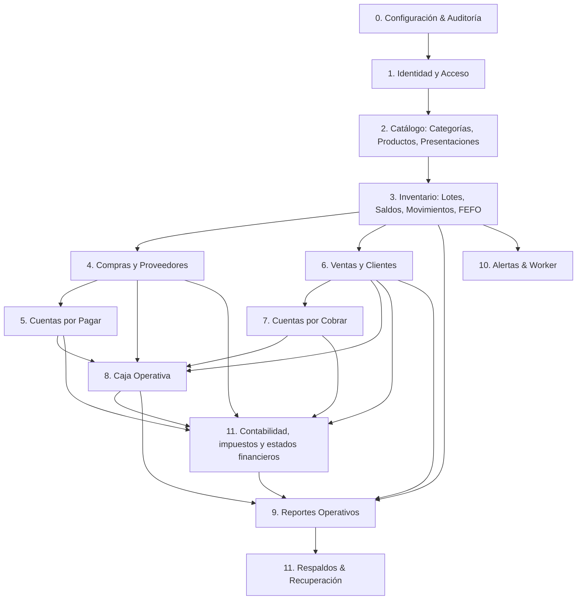

# Plan Técnico de Desarrollo — Sistema de Gestión para Farmacia

**Versión:** 1.0  
**Fecha:** 22 de septiembre de 2026  
**Documentos de referencia:**  
- `AGENTS.md` (Reglas y directrices de desarrollo)  
- `levantamiento-requerimientos-farmacia.md`  
- `arquitectura-software-farmacia.md`  
- `diseno-ux-ui-farmacia.md`  
**Estado:** Propuesta técnica de ejecución y roadmap incremental  

---

## 1. Resumen Ejecutivo y Diagnóstico

El presente documento establece la hoja de ruta técnica e incremental para el desarrollo del **Sistema de Gestión para Farmacia**, bajo una arquitectura de **Monolito Modular** en TypeScript (NestJS 11 en backend, React 19 + Vite 8 + Material UI 9 en frontend, PostgreSQL 18 como base de datos única y Worker para procesamiento en segundo plano).

El sistema prioriza de forma no negociable:
1. **Consistencia transaccional e integridad de inventario** (asignación FEFO concurrente con bloqueos de fila `SELECT ... FOR UPDATE`, libro inmutable de movimientos y prohibición de inventario negativo).
2. **Precisión numérica en dinero y cantidades** (tipo `numeric` para dinero, nunca flotantes; cantidades en unidades base discretas enteras y factores históricos en transacciones).
3. **Seguridad y trazabilidad** (autorización verificada exclusivamente en backend, sesiones opacas persistentes en cookies seguras, registro transversal de auditoría con `correlationId`).
4. **Agilidad operativa en el punto de venta** (registro de venta de alta velocidad, búsqueda/escaneo rápido, prevención de doble confirmación con claves de idempotencia).

---

## 2. Clasificación del Estado de Requisitos y Decisiones

### 2.1 Requerimientos Funcionales Confirmados (Alcance MVP)
- **RF-001 / RF-002**: Catálogo de categorías y productos con atributos farmacéuticos básicos.
- **RF-003 / RF-004**: Manejo de presentaciones comerciales (unidad, caja, blíster) y factores de equivalencia a unidad base.
- **RF-005 / RF-006 / RF-007**: Control de inventario por producto y lote con fecha de vencimiento.
- **RF-008 / RF-009**: Alertas de vencimiento y algoritmo obligatorio de despacho por vencimiento primero (FEFO).
- **RF-010 / RF-011 / RF-012**: Administración de proveedores, registro de compras y recepción de compras con ingreso de lotes y vencimientos.
- **RF-013 / RF-014 / RF-015**: Catálogo de clientes, registro de ventas con asignación FEFO automática y salida de inventario inmutable.
- **RF-016 / RF-017**: Cuentas por cobrar y registro de recaudos o abonos de clientes.
- **RF-018 / RF-019**: Cuentas por pagar y registro de pagos a proveedores.
- **RF-020**: Control operativo de caja y movimientos asociados a compras y ventas.
- **RF-021 / RF-022**: Administración de usuarios, roles y control de acceso por permisos.
- **RF-023 / RF-024**: Libro inmutable de movimientos de inventario y consulta de trazabilidad.
- **RF-025**: Reportes operativos básicos (existencias, lotes por vencer, kardex, ventas, caja).
- **RF-026**: Copias de seguridad periódicas y procedimiento de restauración validado.
- **RF-028 / RF-035**: Plan de cuentas manual o importable desde Excel, impuestos configurables, asientos automáticos, tesorería bancaria, gastos por causación, devoluciones y estados financieros.

### 2.2 Reglas de Negocio Confirmadas
- **RN-001**: **Regla FEFO Estricta**: La salida de medicamentos debe consumir prioritariamente el lote disponible con la fecha de vencimiento más próxima.
- **RN-002**: **Identificación de Lote**: Todo medicamento sujeto a lote debe conservar su código de lote y fecha de vencimiento.
- **RN-003**: **Presentaciones**: Soporte de unidad, caja y blíster convertibles a unidad base.
- **RN-AG-01**: **Dinero**: Prohibido usar números de coma flotante; usar tipos numéricos exactos (`numeric`) o enteros en centavos.
- **RN-AG-02**: **Cantidades en Unidad Base**: El inventario se almacena y calcula en unidades base discretas enteras. Los documentos comerciales conservan presentación, cantidad comercial y factor de conversión histórico aplicado en la transacción.
- **RN-AG-03**: **Inmutabilidad de Inventario**: No se eliminan ni editan movimientos históricos de inventario; correcciones o anulaciones generan movimientos compensatorios inversos.
- **RN-AG-04**: **Idempotencia**: Confirmación de ventas, pagos y operaciones críticas deben usar clave de idempotencia (`Idempotency-Key`) para prevenir duplicaciones.
- **RN-AG-05**: **Autorización en Backend**: Los permisos se verifican de forma obligatoria en la capa de aplicación/casos de uso del backend.
- **RN-010 / RN-015**: Partida doble e inmutabilidad contable; impuesto separado del ingreso; reglas tributarias configurables; costo neto de descuentos; causación de gastos y devoluciones por línea.

### 2.3 Decisiones Arquitectónicas Aprobadas
- **ADR-001 (Monolito Modular)**: Un solo repositorio con `pnpm workspaces` (`apps/api`, `apps/web`, `apps/worker`, `packages/contracts`). Límites de módulo estrictos con 4 capas internas: `presentation`, `application`, `domain`, `infrastructure`. El dominio es puro (sin dependencias de NestJS, Prisma o HTTP).
- **ADR-002 (PostgreSQL 18 Único)**: Base de datos relacional para transacciones ACID, integridad referencial y bloqueos de fila (`SELECT ... FOR UPDATE`).
- **ADR-003 (Acceso a Datos Mixto con Prisma 8)**: Prisma ORM para CRUD tipado y migraciones; SQL nativo parametrizado para asignación FEFO con bloqueos de concurrencia.
- **ADR-004 (Sesiones Opacas en Cookies)**: Autenticación mediante sesión en PostgreSQL con cookie `HttpOnly`, `Secure`, `SameSite=Lax`, contraseñas con Argon2id y revocación inmediata.
- **ADR-005 (Worker y Cola en PostgreSQL)**: Procesamiento asíncrono y tareas programadas usando tabla persistente de jobs en PostgreSQL (bloqueo skip-locked) y patrón Outbox.
- **ADR-006 (Frontend SPA React 19 + MUI 9)**: SPA optimizada para escritorio y tablet en caja, TanStack Query para estado remoto, React Hook Form y Zod para formularios.
- **ADR-007 (Infraestructura Contenerizada)**: Docker Compose v2 con Caddy 2 como proxy inverso y terminador TLS automático en servidor Linux.

### 2.4 Supuestos del Proyecto (Sujetos a Validación)
- La farmacia es una pyme con operación de decenas de usuarios concurrentes (no miles).
- La farmacia opera de manera centralizada en línea (se asume conectividad a internet estable para el MVP).
- El MVP opera con una sede física principal (se prepara el esquema con entidad `Location` para compatibilidad futura).
- No se requiere soporte transaccional offline en el MVP.
- No se requiere aplicación móvil nativa en la primera fase.

### 2.5 Decisiones Pendientes del Cliente y Preguntas Abiertas
1. **Bloqueo de medicamentos vencidos**: ¿Debe el sistema bloquear de manera infranqueable la venta de lotes cuya fecha de vencimiento sea igual o anterior a la fecha actual? *(Recomendación técnica: SÍ, bloquear por defecto)*.
2. **Excepciones a FEFO**: ¿Se permitirá en algún caso que un usuario seleccione un lote distinto al sugerido por FEFO? Si se permite, ¿qué perfil lo autoriza y qué motivo formal se exige?
3. **Fraccionamiento multi-lote**: Si el lote con vencimiento más próximo no cubre la cantidad solicitada en la venta, ¿el sistema debe repartir automáticamente el remanente en el siguiente lote disponible? *(Recomendación técnica: SÍ, asignación split)*.
4. **Flujo de Compras**: ¿Se requiere aprobación previa u orden de compra, o la compra se registra directamente contra la factura del proveedor cargando el inventario de inmediato?
5. **Operación de Caja**: ¿Se maneja una sola caja general o múltiples cajas con apertura, base inicial, arqueo ciego y cierre de turno por cajero?
6. **Políticas de Crédito y Cartera**: ¿Cuáles son las condiciones para otorgar crédito a un cliente (plazo en días, cupo máximo, autorización de supervisor)?
7. **Anticipación de Alertas de Vencimiento**: ¿Con cuántos días de antelación se debe emitir la alerta de vencimiento (p. ej. 30, 60 y 90 días)?
8. **Matriz Definitiva de Roles y Permisos**: ¿Cuáles son los roles formales de la farmacia y qué acciones exactas puede ejecutar cada uno?

### 2.6 Funcionalidades Excluidas Explícitamente del MVP
- **Facturación Electrónica DIAN**: Pospuesta formalmente para la Fase 2 / Fase Posterior (requiere resolución tributaria, certificado digital y proveedor tecnológico habilitado).
- **Venta Offline / Sincronización Local PWA**: La confirmación de ventas offline está fuera del alcance inicial.
- **Comercio electrónico y domicilios**: No contemplados en el alcance operativo de farmacia.
- **Nómina, activos fijos, declaraciones tributarias y conciliación bancaria automática**: Fuera del alcance inicial de contabilidad; se evaluarán en fases posteriores.
- **Microservicios, Redis, Kafka**: Prohibidos por arquitectura aprobada.

### 2.7 Contradicciones y Tensiones Identificadas entre Documentos
1. **Multi-sede vs. Sede Única**: El levantamiento indica que el número de sedes está pendiente, mientras que la arquitectura y diseño mencionan sedes y ubicaciones.  
   *Resolución en Plan:* Se implementa el modelo de datos con una sede/ubicación por defecto (`default_location_id`) para no romper la regla futura sin añadir complejidad innecesaria al MVP actual.
2. **Apertura de Caja y Turnos**: El diseño UX/UI propone pantallas para apertura y cierre de caja (`UX-25` y `UX-26`), pero el levantamiento indica que el flujo de caja está pendiente de definición por el cliente.  
   *Resolución en Plan:* Se aísla el slice de apertura/cierre de turnos y se marca como **BLOQUEADO** hasta obtener la respuesta del cliente, permitiendo implementar primero el registro básico de movimientos de caja originados por ventas y compras.
3. **Excepción manual a FEFO**: En UX/UI se describe un botón para "Cambiar lote", pero en requerimientos y en `AGENTS.md` FEFO es obligatorio y cualquier excepción está pendiente de validación.  
   *Resolución en Plan:* La funcionalidad de excepción a FEFO queda **BLOQUEADA**; el sistema asigna de forma 100% automática por FEFO en el MVP inicial.

---

## 3. Matriz de Dependencias entre Módulos



---

## 4. Estructura de Épicas del Proyecto

| Épica | Nombre | Objetivo | Estado |
|---|---|---|---|
| **EP-00** | **Fundaciones del Repositorio y Arquitectura Base** | Configurar el monorepo, entornos, contratos, pipeline de CI y calidad técnica base | **IMPLEMENTADA** |
| **EP-01** | **Identidad, Control de Acceso y Auditoría** | Autenticación basada en sesiones seguras, control de permisos en backend y registro inmutable de auditoría | **IMPLEMENTADA** |
| **EP-02** | **Catálogo: Categorías, Productos y Presentaciones** | Gestión de productos con atributos farmacéuticos y factores de equivalencia en unidades base | **IMPLEMENTADA** |
| **EP-03** | **Inventario: Lotes, Movimientos y Asignación FEFO** | Control de existencias por lote, libro mayor inmutable y motor transaccional FEFO con bloqueo de concurrencia | **IMPLEMENTADA** |
| **EP-04** | **Abastecimiento: Proveedores y Recepción de Compras** | Gestión de proveedores e ingreso de mercancía con asignación de lotes y fechas de vencimiento | **IMPLEMENTADA** |
| **EP-05** | **Operación de Caja** | Control de caja, balance de efectivo y trazabilidad de ingresos y egresos | **EN PROGRESO: HU-014 operativa; HU-015 bloqueada; precisión y conciliación pendientes** |
| **EP-06** | **Ventas y Punto de Venta (POS)** | Registro de ventas de alta velocidad con asignación FEFO automática, idempotencia y comprobantes | **EN PROGRESO: flujo base operativo; integración bancaria/fiscal incompleta** |
| **EP-07** | **Finanzas Operativas: Cartera y Cuentas por Pagar** | Gestión de cuentas por cobrar a clientes y cuentas por pagar a proveedores con abonos parciales | **EN PROGRESO: base operativa; validación de pagos por medio pendiente** |
| **EP-08** | **Procesos en Segundo Plano y Alertas de Vencimiento** | Worker programado para evaluación de lotes próximos a vencer y conciliación de saldos | **EN PROGRESO: worker y pruebas existen; cierre de alcance no revalidado** |
| **EP-09** | **Reportes Operativos Básicos y Exportación** | Reportes de existencias, vencimientos, kardex de inventario, ventas y arqueos | **EN PROGRESO: API y pruebas existen; cierre de alcance no revalidado** |
| **EP-10** | **Copias de Seguridad, Resiliencia y Preparación de Producción** | Automatización de respaldos en PostgreSQL, verificación de restauración y hardening | **EN PROGRESO: módulo de copias y pruebas existen; preparación productiva no revalidada** |
| **EP-11** | **Contabilidad, Impuestos y Estados Financieros** | Plan de cuentas, impuestos parametrizados, asientos automáticos, gastos y reportes financieros | **EN PROGRESO: 11.1 y 11.2 implementados; 11.3 y 11.4 parciales; automatizaciones y estados pendientes** |

---

### EP-11 / Slice 11.1 — Plan de cuentas y propósitos contables

**Estado: IMPLEMENTADO.** Incluye administración de cuentas jerárquicas, importación de Excel con validación y vista previa antes de una confirmación transaccional, y mapeo de propósitos contables con estado pendiente cuando todavía no exista una cuenta aprobada. La configuración fiscal confirmada permanece separada de los códigos operativos por aprobar.

El mapeo de `CASH`, `BANK`, `CUSTOMERS`, `SUPPLIERS`, `INVENTORY`, `SALES_TAXED`, `SALES_EXCLUDED`, `COST_OF_SALES`, `CAPITAL`, `CURRENT_YEAR_RESULT`, `VAT_INPUT_COMMON` y `VAT_NON_DEDUCTIBLE` puede continuar pendiente sin impedir este slice. No se asignan códigos sustitutos. La contabilización automática de una operación futura deberá detenerse si falta cualquier propósito obligatorio para esa operación; el motor de partida doble, los asientos y los estados financieros pertenecen a slices posteriores.

El orquestador verificó API, interfaz, importación, migración en `farmacia_test`, build, typecheck, lint y pruebas antes de cerrar este slice. La Épica 11 continúa en progreso: el motor de partida doble y los asientos automáticos siguen pendientes de los mapeos obligatorios de cada operación.

### EP-11 — Estado real por fase del módulo contable

Las fases de esta tabla corresponden al orden del módulo contable en `MODULO_CONTABILIDAD_FARMACIA.md`, sección 47; no sustituyen el roadmap técnico general de la sección 8. `IMPLEMENTADO` exige el flujo completo y pruebas, no solo tablas o pantallas.

| Fase | Alcance | Estado real | Falta principal |
| --- | --- | --- | --- |
| 1. Tesorería | Caja, Banco, cuentas bancarias, medios de pago y movimientos | **EN PROGRESO** | Validar integración completa de transferencias, reversión e idempotencia; eliminar aritmética flotante restante de Caja; conciliar históricos no efectivos; arqueo/cierre bloqueado por política de cajas y turnos. |
| 2. Cartera | Cuentas por cobrar/pagar y abonos | **EN PROGRESO** | Enrutamiento de pagos por medio, trazabilidad bancaria y validación integral. |
| 3. Contabilidad | Plan, libro y motor de asientos | **EN PROGRESO** | Plan y libro internos disponibles; asientos automáticos bloqueados por mapeo operativo y datos tributarios. |
| 4. Gastos | Categorías, causación y pagos | **PENDIENTE** | Reglas y cuentas de gasto aprobadas. |
| 5. Estados financieros | Balance, resultados y auxiliares | **BLOQUEADO** | Asientos operativos, saldos iniciales y política de periodos/cierre. |
| 6. Pruebas integrales | Flujos cruzados y conciliación | **PENDIENTE** | Integración de las fases previas. |

### EP-11 — Slices restantes y dependencias

Esta secuencia es el plan de ejecución, no una declaración de funcionalidades implementadas. Cada slice requiere sus propias pruebas y revisión antes de cambiar de estado.

| Slice | Entregable verificable | Estado | Dependencia principal |
| --- | --- | --- | --- |
| 11.2 | Libro diario interno: partida doble, origen único, inmutabilidad y reversión compensatoria | IMPLEMENTADO | Servicio interno y 12 pruebas PostgreSQL; no genera asientos operativos aún |
| 11.3 | Reglas tributarias versionadas por SKU y operación; base, impuesto y total históricos | EN PROGRESO | API/perfiles y calculadora aislada existen; falta matriz concreta, integración histórica y pruebas de venta/compra |
| 11.4 | Cuentas bancarias y movimientos de tesorería separados de Caja | EN PROGRESO | Catálogo, movimientos manuales, API, UI y pruebas existen; la integración con operaciones y reversión requiere verificación integral, y Caja conserva deuda de precisión e históricos |
| 11.5 | Gastos por causación, pendientes, pagos parciales y anticipos | PENDIENTE | Categorías y cuentas de gasto aprobadas para contabilizar |
| 11.6 | Asientos automáticos atómicos de ventas, compras, recaudos, pagos y ajustes | BLOQUEADO | Mapeos operativos aprobados, datos tributarios y costos exactos |
| 11.7 | Devoluciones por línea y sus efectos financieros y de inventario | BLOQUEADO | Política sanitaria de retorno al inventario y reglas tributarias |
| 11.8 | Balance de comprobación, auxiliares, situación financiera y resultados | BLOQUEADO | Libro diario poblado, saldos iniciales y política de periodos/cierre |
| 11.9 | Validación integral de trazabilidad, idempotencia, impuestos y estados | PENDIENTE | Integración de los slices anteriores |

El archivo `docs/PUC_FARMACIA_PROPUESTA.xlsx` contiene una selección de referencia para revisión contable; no sustituye el mapeo aprobado. Sus cuentas imputables están inactivas y no asigna propósitos. Hay diferencias entre las denominaciones de `135518`, `413595`, `421005` y `417505` en la fuente consultada y los usos mencionados previamente; no se resolverán automáticamente ni se usarán para asientos hasta la validación de la contadora.


---

## 5. Detalle de Historias de Usuario y Slices Implementables

---

### ÉPICA 00: Fundaciones del Repositorio y Arquitectura Base

#### Historia HU-001: Configuración del Monorepositorio y Pipeline de Calidad
- **ID:** `HU-001`
- **Objetivo:** Inicializar la estructura del monorepo con `pnpm workspaces`, configurando los paquetes base (`api`, `web`, `worker`, `contracts`, `database`), linters, formato, tipado estricto y pipeline de CI.
- **Requerimientos relacionados:** Requerimientos arquitectónicos transversales (`arquitectura-software-farmacia.md` secciones 4, 6, 18, 19).
- **Reglas de negocio relacionadas:** Cumplimiento de estándares de código, typecheck y pruebas automatizadas (`AGENTS.md` secciones 4, 12).
- **Módulos afectados:** Estructura global del repositorio (`apps/*`, `packages/*`, `infra/*`).
- **Dependencias:** Ninguna (punto de inicio del proyecto).
- **Riesgos:** Desalineación en versiones de dependencias (Node 24 LTS, Vite 8, NestJS 11).
- **Criterios de aceptación:**
  1. El comando `pnpm install` se ejecuta de forma limpia e instala el workspace completo.
  2. Los comandos `pnpm lint`, `pnpm typecheck` y `pnpm test` se ejecutan sin errores en todos los paquetes.
  3. `docker-compose.yml` base levanta el servicio de PostgreSQL 18 con volumen persistente y configuración de salud (`healthcheck`).
- **Pruebas necesarias:**
  - Comprobación de linting y formateo en CI.
  - Comprobación de compilación TypeScript (`tsc --noEmit`).
  - Prueba de conexión a PostgreSQL desde el contenedor de desarrollo.
- **Definición de Terminado (DoD):**
  - Repositorio estructurado y documentado en README inicial.
  - Configuración compartida de TypeScript (`tsconfig.base.json`) y ESLint/Prettier.
  - Script de arranque de base de datos local funcional.
- **Slices implementables:**
  - `Slice 001.1`: Workspace pnpm con `apps/api`, `apps/web`, `apps/worker`, `packages/contracts` y scripts globales.
  - `Slice 001.2`: Configuración Docker Compose para PostgreSQL 18 local con script de inicialización.
  - `Slice 001.3`: Pipeline de CI básico (script local de verificación: format, lint, typecheck).

---

### ÉPICA 01: Identidad, Control de Acceso y Auditoría

#### Historia HU-002: Autenticación por Sesión Opaca Segura
- **ID:** `HU-002`
- **Objetivo:** Permitir a los usuarios iniciar y cerrar sesión mediante credenciales locales (usuario/correo y contraseña), generando sesiones opacas persistidas en PostgreSQL y entregadas en cookies seguras.
- **Requerimientos relacionados:** `RF-021`, `RNF-001`, `ADR-004`.
- **Reglas de negocio relacionadas:** `RN-AG-04` (seguridad y sesiones revocables inmediatamente).
- **Módulos afectados:** Módulo de Identidad y Acceso (`apps/api/src/modules/identity`).
- **Dependencias:** `HU-001`.
- **Riesgos:** Vulnerabilidades CSRF si las cookies no están correctamente configuradas con `SameSite` y tokens anti-CSRF para métodos mutantes.
- **Criterios de aceptación:**
  1. El endpoint `POST /api/v1/auth/login` valida credenciales contra hash Argon2id y crea un registro de sesión con expiración configurable.
  2. La respuesta incluye una cookie `sid` con atributos `HttpOnly`, `Secure`, `SameSite=Lax`.
  3. El endpoint `POST /api/v1/auth/logout` invalida la sesión en la base de datos y borra la cookie en el navegador.
  4. El endpoint `GET /api/v1/auth/me` retorna la información del usuario autenticado y sus permisos.
  5. Intentos repetidos de autenticación fallida aplican límite de tasa (*rate limiting*).
- **Pruebas necesarias:**
  - Unitarias: Verificación y hashing de contraseñas con Argon2id.
  - Integración: Flujo completo de login, validación de cookie en peticiones protegidas y revocación en logout con base de datos real.
- **Definición de Terminado (DoD):**
  - Endpoints implementados con DTOs validados con Zod/class-validator.
  - Middleware/Guard de autenticación activo en NestJS.
  - Pantalla básica de Login en Frontend (`UX-01`) integrada con feedback de error accesible.
- **Slices implementables:**
  - `Slice 002.1`: Modelo Prisma de `users` y `sessions` con migración inicial.
  - `Slice 002.2`: Servicio de hashing Argon2id y autenticación en capa de aplicación backend.
  - `Slice 002.3`: Endpoints de sesión (`/login`, `/logout`, `/me`) y Guard de autenticación.
  - `Slice 002.4`: Interfaz de inicio de sesión en React (`UX-01`) con React Hook Form.

#### Historia HU-003: Control de Acceso Basado en Roles y Permisos (RBAC)
- **ID:** `HU-003`
- **Objetivo:** Restringir el acceso a casos de uso y recursos del backend mediante roles y permisos explícitos asignados al usuario.
- **Requerimientos relacionados:** `RF-021`, `RF-022`, `RNF-001`.
- **Reglas de negocio relacionadas:** `RN-AG-05` (validación obligatoria en backend).
- **Módulos afectados:** `identity`, transversal a toda la API.
- **Dependencias:** `HU-002`.
- **Riesgos:** La falta de definición de la matriz final del cliente puede requerir ajustes; se debe construir un esquema dinámico y flexible basado en permisos atómicos (`permission_key`).
- **Criterios de aceptación:**
  1. Cada usuario tiene uno o más roles asignados, y cada rol contiene un conjunto de permisos (`string` identificador, p. ej. `products:read`, `sales:create`).
  2. Un Guard de autorización (`PermissionsGuard`) en NestJS verifica que el usuario cuente con los permisos requeridos antes de ejecutar el handler del controlador.
  3. Si el usuario no tiene el permiso, el servidor responde `403 Forbidden` con payload de error estandarizado.
  4. El frontend recibe los permisos en `/me` y adapta la interfaz (oculta o deshabilita botones), pero la seguridad reside en el backend.
- **Pruebas necesarias:**
  - Unitarias de `@RequirePermissions(...)` guard.
  - Integración: Intento de acceso a endpoints protegidos con rol sin privilegios y con rol autorizado.
- **Definición de Terminado (DoD):**
  - Modelos `roles`, `permissions`, `user_roles`, `role_permissions` en Prisma.
  - Seed inicial con rol de Super Administrador.
  - Decoradores y Guards documentados.
- **Slices implementables:**
  - `Slice 003.1`: Esquema de datos para RBAC y seed de permisos base.
  - `Slice 003.2`: Guard de autorización y decorador `@RequirePermissions()`.
  - `Slice 003.3`: Contexto de permisos en frontend para renderizado condicional.

#### Historia HU-004: Registro Inmutable de Auditoría
- **ID:** `HU-004`
- **Objetivo:** Registrar un log estructurado e inmutable de eventos sensibles del sistema (usuario, fecha UTC, acción, entidad, identificador, valores previos y nuevos, IP y `correlationId`).
- **Requerimientos relacionados:** `RNF-003`, `arquitectura-software-farmacia.md` sección 22.
- **Reglas de negocio relacionadas:** Trazabilidad obligatoria de acciones administrativas y de negocio.
- **Módulos afectados:** Módulo transversal de Auditoría (`audit`).
- **Dependencias:** `HU-002`.
- **Riesgos:** Alto volumen de registros si se auditan lecturas innecesarias; debe limitarse a mutaciones críticas (seguridad, ajustes, precios, ventas, compras).
- **Criterios de aceptación:**
  1. La tabla `audit_events` almacena registros inmutables con usuario, acción, entidad, entidad_id, detalles en JSONB, dirección IP y `correlation_id`.
  2. Se expone un servicio de auditoría inyectable para ser invocado dentro de las transacciones de casos de uso.
  3. No se permite actualizar ni eliminar registros de la tabla `audit_events` (garantizado por restricciones).
- **Pruebas necesarias:**
  - Integración: Verificación de persistencia correcta del evento ante una acción auditada.
- **Definición de Terminado (DoD):**
  - Módulo `audit` implementado e integrado con Pino Logger.
- **Slices implementables:**
  - `Slice 004.1` (IMPLEMENTADO): Tabla `audit_events` con trigger de inmutabilidad (append-only) y servicio transaccional `AuditService`.
  - `Slice 004.2` (IMPLEMENTADO): Interceptor global y middleware de `correlationId` HTTP, decorador `@CorrelationId()`, filtro global de excepciones y auditoría automática de autenticación en PostgreSQL.

---

### ÉPICA 02: Catálogo: Categorías, Productos y Presentaciones

#### Historia HU-005: Gestión de Categorías de Productos
- **ID:** `HU-005`
- **Objetivo:** Permitir a usuarios autorizados registrar, consultar, editar y desactivar categorías para organizar los productos.
- **Requerimientos relacionados:** `RF-001`.
- **Reglas de negocio relacionadas:** No se eliminan físicamente categorías que tengan productos asociados (inactivación lógica).
- **Módulos afectados:** Módulo de Catálogo (`catalog`).
- **Dependencias:** `HU-003`, `HU-004`.
- **Riesgos:** Ninguno significativo; CRUD administrativo estándar.
- **Criterios de aceptación:**
  1. `POST /api/v1/categories` permite crear una categoría con nombre único y descripción.
  2. `GET /api/v1/categories` lista categorías activas con paginación y búsqueda por texto.
  3. `PUT /api/v1/categories/:id` actualiza los datos de la categoría.
  4. `DELETE /api/v1/categories/:id` inactiva la categoría si no tiene productos activos asociados.
- **Pruebas necesarias:**
  - Unitarias de validación DTO.
  - Integración: Creación, consulta y rechazo de nombres duplicados.
- **Definición de Terminado (DoD):**
  - Endpoints REST con OpenAPI documentado.
  - Vista frontend `UX-08` implementada con Material UI.
- **Slices implementables:**
  - `Slice 005.1` (IMPLEMENTADO): Backend: Modelo Prisma `categories`, migración PostgreSQL, repositorio, servicio de aplicación con auditoría y controlador REST `/api/v1/categories`.
  - `Slice 005.2` (IMPLEMENTADO): Frontend: Pantalla de gestión de categorías (`UX-08`) con diálogo modal para crear/editar y tabla con paginación/búsqueda.

#### Historia HU-006: Catálogo de Productos y Atributos Farmacéuticos
- **ID:** `HU-006`
- **Objetivo:** Registrar y mantener el catálogo de productos con información farmacéutica (código de barras, código interno, nombre comercial, principio activo, concentración, registro sanitario/INVIMA, laboratorio fabricante, categoría y si requiere control por lote/vencimiento).
- **Requerimientos relacionados:** `RF-002`, `RN-002`.
- **Reglas de negocio relacionadas:** Código de barras y código interno únicos. Identificación explícita de productos sujetos a control de lotes y FEFO (medicamentos) vs. productos varios.
- **Módulos afectados:** `catalog`.
- **Dependencias:** `HU-005`.
- **Riesgos:** Sobrecarga de campos no definidos por el cliente; se implementa el conjunto estándar farmacéutico mínimo y extensible.
- **Criterios de aceptación:**
  1. `POST /api/v1/products` registra un producto con validación de unicidad de código interno y código de barras.
  2. El producto define el indicador booleano `requires_lot_control` (por defecto `true` para medicamentos).
  3. `GET /api/v1/products` permite filtrar por categoría, texto de búsqueda (nombre, principio activo, código) y estado activo/inactivo.
  4. Los precios se almacenan en campo `numeric` de alta precisión.
- **Pruebas necesarias:**
  - Integración: Validación de unicidad de códigos, filtrado eficiente con índices en PostgreSQL.
- **Definición de Terminado (DoD):**
  - Entidad de dominio `Product` desacoplada del framework.
  - Pantallas de listado (`UX-06`) y detalle/formulario (`UX-07`) operativas.
  - `Slice 006.1` (IMPLEMENTADO): Modelo de datos de productos, índices y migraciones Prisma en PostgreSQL con soporte para atributos farmacéuticos y precisión decimal.
  - `Slice 006.2` (IMPLEMENTADO): Casos de uso de creación, edición, búsqueda y controlador REST de productos (`POST /api/v1/products`, `GET /api/v1/products`, `GET /api/v1/products/:id`, `PUT /api/v1/products/:id`, `DELETE /api/v1/products/:id`) con entidad de dominio desacoplada, repositorio y auditoría.
  - `Slice 006.3` (IMPLEMENTADO): Interfaz de consulta y formulario de producto en frontend (`UX-06`, `UX-07`) con soporte para atributos farmacéuticos, filtrado por búsqueda/categoría/estado, modal accesible y pruebas automatizadas.

#### Historia HU-007: Presentaciones Comerciales y Factores de Equivalencia (IMPLEMENTADA)
- **ID:** `HU-007`
- **Objetivo:** Configurar las presentaciones comerciales permitidas para cada producto (Unidad, Caja, Blíster) y definir sus factores de equivalencia en términos de una unidad base común entera.
- **Requerimientos relacionados:** `RF-003`, `RF-004`, `CA-004`.
- **Reglas de negocio relacionadas:** `RN-003`, `RN-004`, `RN-005`, `RN-AG-02`. Cantidades en unidad base discretas enteras.
- **Módulos afectados:** `catalog`, base para `inventory`.
- **Dependencias:** `HU-006`.
- **Riesgos:** Configuraciones inconsistentes de factores (ej. factor menor o igual a 0).
- **Criterios de aceptación:**
  1. Cada producto tiene una unidad base fija (ej. "Tableta" o "Unidad", factor = 1).
  2. Se pueden asociar presentaciones comerciales adicionales (ej. "Blíster de 10" con factor 10, "Caja de 30" con factor 30).
  3. Los factores de conversión deben ser números enteros positivos mayores a cero.
  4. La entidad expone un método de dominio `toBaseUnits(quantity, presentationId)` y `fromBaseUnits(baseUnits, presentationId)`.
  5. Se impide eliminar presentaciones que ya hayan sido utilizadas en movimientos de inventario confirmados.
- **Pruebas necesarias:**
  - Unitarias exhaustivas: Conversión matemática exacta entre caja, blíster y unidad base sin pérdida de precisión.
- **Definición de Terminado (DoD):**
  - Reglas de conversión encapsuladas en el dominio.
  - Formulario de configuración de presentaciones en el detalle del producto (`UX-07`).
- **Slices implementables:**
  - `Slice 007.1` (IMPLEMENTADO): Modelo de datos `product_presentations` con restricciones de integridad (CHECK factor > 0, price >= 0, cost >= 0), claves foráneas con Restrict, índices de concurrencia y migración PostgreSQL 18.
  - `Slice 007.2` (IMPLEMENTADO): Lógica de conversión en el dominio `ProductPresentation` (`toBaseUnits`, `fromBaseUnits`) con pruebas unitarias, repositorio Prisma y endpoints REST (`POST/GET/PUT/DELETE /api/v1/products/:productId/presentations`, `POST .../convert`) con auditoría y RBAC.
  - `Slice 007.3` (IMPLEMENTADO): Subformulario de presentaciones comerciales y factores de conversión a unidad base en frontend (`UX-07`) con diálogo interactivo, calculadora de conversión matemática, integración con catálogo y pruebas automatizadas (6/6 pasadas).

---

### ÉPICA 03: Inventario Central: Lotes, Movimientos y Asignación FEFO

#### Historia HU-008: Control de Lotes y Fechas de Vencimiento
- **ID:** `HU-008`
- **Objetivo:** Registrar y controlar las existencias de productos agrupadas por número de lote, fecha de vencimiento y ubicación, manteniendo saldos materializados exactos.
- **Requerimientos relacionados:** `RF-006`, `RF-007`, `RN-002`, `CA-003`.
- **Reglas de negocio relacionadas:** Todo lote tiene código alfanumérico y fecha de vencimiento estricta. El saldo disponible del lote nunca puede ser negativo.
- **Módulos afectados:** Módulo de Inventario (`inventory`).
- **Dependencias:** `HU-007`.
- **Riesgos:** Corrupción de saldos por concurrencia; mitigado mediante actualización dentro de la misma transacción del movimiento.
- **Criterios de aceptación:**
  1. La entidad `inventory_lots` identifica un lote por producto, código de lote, fecha de vencimiento y ubicación.
  2. Mantiene el campo `current_quantity` (en unidades base) que refleja la existencia disponible actual.
  3. Se prohíbe mediante restricción (`CHECK (current_quantity >= 0)`) que el saldo sea negativo.
  4. Se crea un índice en `(product_id, expiration_date ASC, current_quantity)` para acelerar consultas FEFO.
- **Pruebas necesarias:**
  - Integración: Inserción de lote, actualización de existencia y verificación de rechazo ante saldo negativo.
- **Definición de Terminado (DoD):**
  - Tabla de lotes y saldos en Prisma.
  - Vistas de consulta de lotes y vencimientos en frontend (`UX-10`, `UX-11`).
- **Slices implementables:**
  - `Slice 008.1` (IMPLEMENTADO): Esquema de datos para `locations` e `inventory_lots` en PostgreSQL 18 con restricciones de integridad (CHECK current_quantity >= 0, unicidad de lot_number por producto/ubicación, claves foráneas RESTRICT), índices de optimización FEFO `(product_id, expiration_date ASC, current_quantity)` y migración aplicada con pruebas de integración (4/4 pasadas, 57/57 totales).
  - `Slice 008.2` (IMPLEMENTADO): Casos de uso de consulta y registro de existencias por lote y producto en NestJS (`apps/api`) con entidad de dominio desacoplada, repositorio de infraestructura Prisma, endpoints protegidos por RBAC (`/api/v1/inventory/lots`, `/api/v1/inventory/locations`, `/api/v1/inventory/products/:id/fefo`), auditoría automática y pruebas unitarias de dominio (5/5 pasadas).
  - `Slice 008.3` (IMPLEMENTADO): Pantalla de consulta de lotes y detalle de vencimientos en React (`UX-10`, `UX-11`) con cálculo visual de estado FEFO por días restantes, filtros de búsqueda, modal de registro de lotes y navegación integrada.

#### Historia HU-009: Libro Inmutable de Movimientos de Inventario (Kardex)
- **ID:** `HU-009`
- **Objetivo:** Registrar cada cambio en el inventario como un movimiento inmutable en `inventory_movements`, garantizando trazabilidad completa de entradas, salidas y ajustes.
- **Requerimientos relacionados:** `RF-023`, `RF-024`, `RN-AG-03`, `RN-009`.
- **Reglas de negocio relacionadas:** Movimientos confirmados no se pueden modificar ni eliminar. Cada movimiento guarda cantidad en unidad base, presentación original, factor histórico, lote, documento origen y usuario.
- **Módulos afectados:** `inventory`.
- **Dependencias:** `HU-008`.
- **Riesgos:** Discrepancia entre la suma de movimientos históricos y el saldo materializado del lote.
- **Criterios de aceptación:**
  1. La tabla `inventory_movements` almacena: `id`, `movement_type` (ENTRADA_COMPRA, SALIDA_VENTA, AJUSTE_POSITIVO, AJUSTE_NEGATIVO, etc.), `product_id`, `lot_id`, `quantity_base_units`, `presentation_id`, `presentation_factor_historical`, `reference_document_type`, `reference_document_id`, `created_at`, `created_by_user_id`.
  2. Toda operación de inventario crea el registro en `inventory_movements` y actualiza `inventory_lots.current_quantity` dentro de la **misma transacción de base de datos**.
  3. Se provee un endpoint para consultar el kardex de un producto o lote con filtros por rango de fechas.
- **Pruebas necesarias:**
  - Integración: Comprobación de que la suma de movimientos coincide exactamente con el saldo actual materializado.
- **Definición de Terminado (DoD):**
  - Servicio de inventario con método transaccional `recordMovement()`.
  - Pantalla de trazabilidad de movimientos en frontend (`UX-12`).
- **Slices implementables:**
  - `Slice 009.1` (IMPLEMENTADO): Tabla `inventory_movements` en PostgreSQL 18 con restricciones de integridad (CHECK balance_after_base_units >= 0), claves foráneas RESTRICT hacia producto, lote y presentación, migración aplicada y prueba de integración de persistencia con Vitest.
  - `Slice 009.2` (IMPLEMENTADO): Repositorio y servicio transaccional `InventoryMovementService` en NestJS (`apps/api`) con método `recordMovement()` con actualización atómica de saldos en lote, registro inmutable de Kardex, eventos de auditoría y endpoints REST protegidos.
  - `Slice 009.3` (IMPLEMENTADO): Pantalla de consulta de Kardex e historial de movimientos en React (`UX-12`) con filtrado por producto y tipo de movimiento, distintivos de color por naturaleza de entrada/salida y paginación.

#### Historia HU-010: Motor de Asignación FEFO con Bloqueo Concurrente
- **ID:** `HU-010`
- **Objetivo:** Implementar el algoritmo FEFO (First Expired, First Out) que seleccione automáticamente los lotes disponibles con vencimiento más próximo durante las salidas de medicamentos, bloqueando las filas concurrentes mediante `SELECT ... FOR UPDATE`.
- **Requerimientos relacionados:** `RF-009`, `RN-001`, `CA-001`, `CA-002`.
- **Reglas de negocio relacionadas:** `RN-001` (FEFO estricto), `RN-AG-01`, `RN-AG-02`. Asignación automática sin intervención manual. Prohibido asignar lotes vencidos si se confirma la regla de protección.
- **Módulos afectados:** `inventory`, base para `sales`.
- **Dependencias:** `HU-008`, `HU-009`.
- **Riesgos:** Condiciones de carrera entre dos ventas simultáneas que intentan descontar del mismo lote disponible; mitigado con `SELECT FOR UPDATE` en PostgreSQL.
- **Criterios de aceptación:**
  1. Dado un producto y una cantidad requerida en unidades base, el servicio consulta los lotes disponibles ordenados por `expiration_date ASC, created_at ASC`.
  2. Las filas de los lotes seleccionados se bloquean dentro de la transacción con `FOR UPDATE`.
  3. Si el primer lote no cubre la cantidad total requerida, el algoritmo fracciona automáticamente el saldo en el siguiente lote con vencimiento más próximo (*split allocation*).
  4. Si la suma total de existencias disponibles en los lotes no vencidos es inferior a la cantidad solicitada, la transacción falla con error de dominio `InsufficientInventoryException` y no realiza ningún cambio.
  5. Dos transacciones concurrentes sobre el mismo lote se serializan ordenadamente sin generar saldos negativos ni doble asignación.
- **Pruebas necesarias:**
  - Unitarias del algoritmo de asignación con múltiples lotes y cantidades fraccionadas.
  - **Prueba crítica de concurrencia en PostgreSQL real**: Ejecutar 10 peticiones concurrentes simultáneas intentando vender existencias limitadas de un lote y verificar que exactamente la cantidad física real sea asignada sin inconsistencias.
- **Definición de Terminado (DoD):**
  - Caso de uso `AllocateFefoStock` probado con base de datos real bajo concurrencia.
  - Contrato de servicio interno listo para ser consumido por el módulo de Ventas.
- **Slices implementables:**
  - `Slice 010.1` (IMPLEMENTADO): Algoritmo puro de dominio FEFO `FefoAllocationEngine` para cálculo y distribución de lotes ordenados por vencimiento (`expiration_date ASC`), soporte para fraccionamiento automático (*split allocation*), exclusión de vencidos y pruebas unitarias (4/4 pasadas).
  - `Slice 010.2` (IMPLEMENTADO): Método de infraestructura `allocateStockFefoTransactional` con SQL nativo parametrizado y bloqueo de fila pesimista `SELECT ... FOR UPDATE` en PostgreSQL nativo, deducción atómica de saldos, registro en Kardex y endpoint REST `POST /api/v1/inventory/products/:id/allocate-fefo`. *Retirado en AUD-004 (2026-10-08): descontaba stock sin venta ni caja; la venta conserva su propia asignación FEFO transaccional.*
  - `Slice 010.3` (IMPLEMENTADO): Suite de pruebas automatizadas de concurrencia e integración ejecutando 10 peticiones simultáneas sobre el mismo lote con PostgreSQL 18 real, garantizando serialización estricta, prevención de saldos negativos y total consistencia en el Kardex.

#### Historia HU-011: Ajustes Manuales de Inventario con Permisos de Supervisor
- **ID:** `HU-011`
- **Objetivo:** Permitir a usuarios con permiso especial registrar ajustes positivos o negativos de inventario, justificando obligatoriamente el motivo (avería, pérdida, conteo físico, corrección) y registrando el evento en auditoría.
- **Requerimientos relacionados:** `RF-023`, `RN-009`.
- **Reglas de negocio relacionadas:** Los ajustes impactan el libro mayor de movimientos y el saldo del lote. Un ajuste negativo no puede superar la existencia actual.
- **Módulos afectados:** `inventory`, `audit`.
- **Dependencias:** `HU-009`, `HU-003`, `HU-004`.
- **Riesgos:** Fraude o descuadre operativo; mitigado requiriendo permiso de supervisor y motivo obligatorio.
- **Criterios de aceptación:**
  1. Endpoint `POST /api/v1/inventory-adjustments` requiere permiso `inventory:adjust`.
  2. Solicita: producto, lote, tipo de ajuste (incremento/decremento), cantidad, presentación y justificación de texto obligatoria.
  3. Registra el movimiento en `inventory_movements` con tipo `AJUSTE` y crea un evento en `audit_events`.
- **Pruebas necesarias:**
  - Integración: Permisos de acceso, actualización de saldo y auditoría.
- **Definición de Terminado (DoD):**
  - Caso de uso implementado y pantalla en frontend `UX-13` con diálogo de confirmación de impacto.
- **Slices implementables:**
  - `Slice 011.1` (IMPLEMENTADO): Backend: Caso de uso transaccional `adjustInventory` y endpoint protegido `POST /api/v1/inventory/movements/adjust` con verificación de permiso `inventory:adjust`, validación de motivo formal obligatorio, prevención estricta de saldos negativos, actualización atómica del lote, inserción inmutable en `inventory_movements` y auditoría en `audit_events`.
  - `Slice 011.2` (IMPLEMENTADO): Frontend: Componente de ajuste manual de inventario `AdjustInventoryDialog.tsx` (`UX-13`) integrado en `InventoryLotsPage.tsx`, con selección de tipo de ajuste (POSITIVO / NEGATIVO), validación reactiva de existencias, cálculo visual de saldo resultante y confirmación explícita de impacto.

---

### ÉPICA 04: Abastecimiento: Proveedores y Recepción de Compras

#### Historia HU-012: Administración de Proveedores
- **ID:** `HU-012`
- **Objetivo:** Gestionar el directorio de proveedores de la farmacia (identificación/NIT, razón social, contacto, teléfono, correo, dirección).
- **Requerimientos relacionados:** `RF-010`.
- **Reglas de negocio relacionadas:** NIT o documento de identificación único. Inactivación lógica si tiene compras asociadas.
- **Módulos afectados:** Módulo de Proveedores (`suppliers`).
- **Dependencias:** `HU-003`, `HU-004`.
- **Riesgos:** Ninguno.
- **Criterios de aceptación:**
  1. CRUD completo de proveedores con validaciones de formato de documento y contacto.
  2. Búsqueda y autocompletado rápido para selección en compras.
- **Pruebas necesarias:**
  - Integración de unicidad de documento de proveedor.
- **Definición de Terminado (DoD):**
  - Módulo backend y pantalla frontend `UX-19` completados.
- **Slices implementables:**
  - `Slice 012.1` (IMPLEMENTADO): Modelo `suppliers` en PostgreSQL 18 con índice único en `tax_id`, migración aplicada, entidad pura de dominio `Supplier`, repositorio `PrismaSupplierRepository`, servicio `SupplierService` con eventos de auditoría y endpoints REST en `/api/v1/suppliers` con protección RBAC (`suppliers:read`, `suppliers:manage`).
  - `Slice 012.2` (IMPLEMENTADO): Pantalla `SuppliersPage` (`UX-19`) en React 19 + Material UI con buscador en tiempo real, filtro de estado activo/inactivo, tabla accesible con datos de contacto, modal reactivo `SupplierFormDialog` para creación/edición, diálogo de confirmación para inactivación y navegación protegida en `AuthenticatedHomePage`.

#### Historia HU-013: Registro y Recepción de Compras con Ingreso de Lotes
- **ID:** `HU-013`
- **Objetivo:** Registrar una compra a un proveedor con número de factura, fecha, líneas de producto recibidas, presentación, costo unitario, cantidad, número de lote y fecha de vencimiento, ingresando automáticamente las existencias al inventario.
- **Requerimientos relacionados:** `RF-011`, `RF-012`, `CA-003`.
- **Reglas de negocio relacionadas:** `RN-002`, `RN-003`, `RN-004`, `RN-AG-01`, `RN-AG-02`. Toda compra confirmada incrementa el inventario y crea o actualiza los lotes correspondientes dentro de una transacción. Costos monetarios en `numeric`.
- **Módulos afectados:** `purchases`, `inventory`, `suppliers`.
- **Dependencias:** `HU-008`, `HU-009`, `HU-012`.
- **Riesgos:** Recepción de productos con fecha de vencimiento ya expirada o inválida; el sistema debe validar que la fecha de vencimiento sea estrictamente futura.
- **Criterios de aceptación:**
  1. `POST /api/v1/purchases/receive` recibe proveedor, número de comprobante/factura, líneas de compra con producto, presentación, cantidad, costo unitario, lote y fecha de vencimiento.
  2. Valida que para medicamentos el lote y la fecha de vencimiento sean obligatorios y que la fecha de vencimiento sea posterior a la fecha actual.
  3. En una sola transacción:
     - Crea el registro de compra y líneas de compra.
     - Crea o actualiza los registros en `inventory_lots`.
     - Registra los movimientos de entrada en `inventory_movements`.
     - Actualiza los saldos materializados de inventario.
  4. Los cálculos de costo total usan aritmética exacta sin coma flotante.
- **Pruebas necesarias:**
  - Integración transaccional: Verificación de rollback total si falla alguna línea de lote en la compra.
- **Definición de Terminado (DoD):**
  - Flujo de compra completo probado en backend.
  - Pantallas de lista de compras (`UX-15`), registro (`UX-16`) y detalle (`UX-18`) implementadas.
- **Slices implementables:**
  - `Slice 013.1` (IMPLEMENTADO): Modelo de datos en PostgreSQL 18 para `purchases` y `purchase_lines` con restricciones de integridad (CHECK total_amount >= 0, quantity_base_units > 0, unit_cost >= 0, subtotal >= 0), claves foráneas RESTRICT hacia proveedores, usuarios, productos, lotes y presentaciones, migración aplicada y suite de pruebas de persistencia en Vitest.
  - `Slice 013.2` (IMPLEMENTADO): Caso de uso transaccional `ReceivePurchase` en NestJS (`apps/api`) con validación de medicamentos (lote y vencimiento estrictamente futuro obligatorios), cálculo aritmético exacto con `Decimal`, actualización atómica en `$transaction` de cabecera de compra, líneas, upsert de `InventoryLot` con incremento de existencias, inserción inmutable de Kardex (`ENTRADA_COMPRA`), auditoría con `correlationId`, DTOs de contrato y endpoints `/api/v1/purchases` protegidos por RBAC.
  - `Slice 013.3` (IMPLEMENTADO): Formulario interactivo `ReceivePurchasePage.tsx` (`UX-16`) en React 19 + MUI con selector de proveedor, número de comprobante, editor dinámico de líneas de productos, presentaciones, lotes, fechas de vencimiento con datepicker, cálculo en vivo de subtotales/total general y diálogo de confirmación de impacto antes del registro.
  - `Slice 013.4` (IMPLEMENTADO): Pantalla de consulta de compras `PurchasesListPage.tsx` (`UX-15`) con buscador por comprobante y proveedor, chips de estado, paginación y modal detallado `PurchaseDetailDialog.tsx` (`UX-18`) con desglose línea a línea de productos recibidos, lotes y fechas de vencimiento.

---

### ÉPICA 05: Operación de Caja

#### Historia HU-014: Control Básico de Movimientos de Caja
- **ID:** `HU-014`
- **Objetivo:** Registrar las entradas y salidas de efectivo derivadas de las operaciones diarias de la farmacia, manteniendo un saldo actualizado y trazabilidad del usuario que opera.
- **Requerimientos relacionados:** `RF-020`.
- **Reglas de negocio relacionadas:** `RN-AG-01` (valores monetarios exactos). Las ventas de contado generan entradas de caja; los egresos autorizados generan salidas de caja.
- **Módulos afectados:** Módulo de Caja (`cash`).
- **Dependencias:** `HU-003`, `HU-004`.
- **Riesgos:** La falta de definición del cliente sobre si hay múltiples cajas o turnos por cajero; se diseña una estructura modular con sesión de caja diaria para aislar el impacto.
- **Criterios de aceptación:**
  1. Registro de operaciones de caja con monto, tipo (INGRESO_VENTA, INGRESO_MANUAL, EGRESO_MANUAL, EGRESO_PAGO_PROVEEDOR), motivo, medio de pago y usuario.
  2. Consulta del saldo actual en caja y listado cronológico de movimientos.
  3. No se permite editar ni borrar movimientos de caja confirmados.
- **Pruebas necesarias:**
  - Integración: Cálculo exacto de saldo tras múltiples ingresos y egresos.
- **Definición de Terminado (DoD):**
  - Endpoints de consulta y registro de movimientos de caja.
  - Pantalla de estado de caja en frontend (`UX-25`).
- **Slices implementables:**
  - `Slice 014.1` (IMPLEMENTADO): Tabla `cash_movements` en PostgreSQL 18 con restricciones de integridad (CHECK amount > 0, CHECK balance_after >= 0), claves foráneas con Restrict hacia `users`, índices optimizados y migración aplicada. Dominio desacoplado `CashMovement` con invariantes y métodos de clasificación (`isIncome`, `isExpense`), repositorio Prisma transaccional con control estricto de saldo previo y prevención de sobregiro físico (`InsufficientCashBalanceException`), auditoría integrada, endpoints en `/api/v1/cash-movements` y `/api/v1/cash-movements/balance` protegidos por RBAC (`cash:read`, `cash:movements`) y pruebas unitarias e integración en Postgres real (14/14 pasadas).
  - `Slice 014.2` (IMPLEMENTADO): Pantalla `CashPage.tsx` (`UX-25`) en React 19 + MUI con tarjetas KPI de saldo actual en caja, ingresos acumulados del día, egresos del día y conteo de transacciones, filtros por tipo de movimiento y medio de pago, tabla paginada con semáforos de color, diálogo interactivo `CreateCashMovementDialog.tsx` con cálculo proyectado de saldo en tiempo real, validación preventiva de sobregiro físico, rutas en `App.tsx` y suite de pruebas de interfaz en Vitest (3/3 pasadas).

#### Historia HU-015: Apertura, Arqueo y Cierre de Turnos de Caja *(BLOQUEADA)*
- **ID:** `HU-015`
- **Objetivo:** Permitir apertura de caja con base inicial en efectivo, control de turnos independientes por cajero y arqueo de cierre con registro de sobrantes y faltantes.
- **Requerimientos relacionados:** `RF-020`.
- **Reglas de negocio relacionadas:** Sujeta a confirmación del cliente sobre el modelo de turnos y cajas.
- **Módulos afectados:** `cash`.
- **Dependencias:** `HU-014`.
- **Estado:** **BLOQUEADA** (Decisión pendiente del cliente #5 y #28: número de cajas, turnos y procedimiento de arqueo).
- **Criterios de aceptación (Provisionales):**
  1. Un cajero no puede registrar ventas sin una sesión de caja abierta.
  2. Al cerrar sesión se ingresa el conteo físico de dinero y se calcula la diferencia frente al sistema.

---

### ÉPICA 06: Ventas y Punto de Venta (POS)

#### Historia HU-016: Catálogo de Clientes
- **ID:** `HU-016`
- **Objetivo:** Administrar los datos de clientes de la farmacia (documento de identidad, nombres/apellidos, teléfono, correo, dirección) y permitir ventas a cliente genérico ("Consumidor Final").
- **Requerimientos relacionados:** `RF-013`.
- **Reglas de negocio relacionadas:** Documento único cuando esté registrado; soporte de cliente por defecto para ventas rápidas de mostrador.
- **Módulos afectados:** Módulo de Clientes (`customers`).
- **Dependencias:** `HU-003`.
- **Riesgos:** Ninguno.
- **Criterios de aceptación:**
  1. CRUD de clientes con búsqueda rápida por número de documento o nombre.
  2. Existencia garantizada en seed de un cliente por defecto ("Cliente General / Cuantías Menores") para ventas rápidas de mostrador.
- **Pruebas necesarias:**
  - Integración de búsqueda y creación de cliente.
- **Definición de Terminado (DoD):**
  - Módulo clientes operativo y pantalla `UX-20`.
- **Slices implementables:**
  - `Slice 016.1` (IMPLEMENTADO): Modelo `Customer` en Prisma/PostgreSQL con clave foránea, restricción única en `document_number`, soporte de cliente predeterminado ("Consumidor Final" `222222222222`), endpoints REST con RBAC (`customers:read`, `customers:manage`), auditoría en `audit_events`, pruebas de persistencia de BD (3/3), pruebas unitarias de dominio (9/9) y pruebas de integración API con PostgreSQL real (6/6).
  - `Slice 016.2` (IMPLEMENTADO): Directorio y catálogo de clientes en React (`UX-20`) con `CustomersPage`, cliente API `customers.api.ts`, modal `CustomerFormDialog` apto para registro rápido desde POS, badges de estado, protección de inactivación para consumidor final y pruebas de UI (3/3) con Vite build validado.


#### Historia HU-017: Punto de Venta Rápido con Asignación FEFO Automática e Idempotencia
- **ID:** `HU-017`
- **Objetivo:** Permitir al cajero/vendedor realizar ventas rápidas en mostrador mediante búsqueda o escáner de código de barras, selección de presentación y cantidad, con cálculo de totales exactos, asignación FEFO transaccional automática de lotes, descuento de inventario, ingreso a caja y protección contra doble confirmación mediante `Idempotency-Key`.
- **Requerimientos relacionados:** `RF-014`, `RF-015`, `RN-001`, `RN-AG-01`, `RN-AG-02`, `RN-AG-04`, `CA-001`, `CA-002`, `CA-004`.
- **Reglas de negocio relacionadas:**
  - Asignación FEFO obligatoria en backend.
  - Bloqueo de concurrencia en lotes.
  - Inmutabilidad de movimientos.
  - Prohibición de inventario negativo.
  - Dinero en tipo `numeric`.
  - Factor histórico preservado.
  - Clave de idempotencia obligatoria en cabecera HTTP.
- **Módulos afectados:** `sales`, `inventory`, `cash`, `customers`, `catalog`.
- **Dependencias:** `HU-010`, `HU-014`, `HU-016`.
- **Riesgos:** Alto impacto operativo. Una falla deja inconsistente el inventario o la caja. Debe ser una transacción atómica única.
- **Criterios de aceptación:**
  1. `POST /api/v1/sales/confirm` requiere cabecera `Idempotency-Key: <uuid>`. Si se reenvía la misma clave con el mismo payload, responde el resultado previo sin volver a ejecutar la transacción.
  2. Valida cliente (o usa cliente genérico), líneas de producto, presentación, cantidad vendida, precio unitario y medio de pago.
  3. Ejecuta en **una sola transacción ACID de PostgreSQL**:
     - Bloqueo de lotes requeridos mediante `SELECT ... FOR UPDATE` ordenados por vencimiento (FEFO).
     - Validación de existencia suficiente; si falta existencia, rollback total y rechazo con código `INSUFFICIENT_STOCK`.
     - Creación de registros en `sales` y `sale_lines`.
     - Creación de registros en `sale_lot_allocations` vinculando cada línea de venta con los lotes consumidos.
     - Registro de movimientos de salida en `inventory_movements`.
     - Actualización de saldos en `inventory_lots`.
     - Registro de ingreso en `cash_movements` (para ventas de contado).
     - Registro del resultado en `idempotency_keys`.
  4. La pantalla de Nueva Venta (`UX-03`) permite operación continua por teclado, muestra totales en tiempo real, indica visualmente la asignación FEFO y deshabilita el botón mostrando "Confirmando venta..." durante el procesamiento.
- **Pruebas necesarias:**
  - Unitarias de cálculo de subtotales, impuestos y totales.
  - Integración: Confirmación exitosa de venta transaccional con descuento en inventario y movimiento de caja.
  - Integración: Verificación de idempotencia (segunda llamada idéntica no duplica movimientos).
  - Concurrencia: Múltiples ventas simultáneas sobre el mismo lote agotan exactamente la existencia sin generar números negativos.
- **Definición de Terminado (DoD):**
  - Caso de uso `ConfirmSale` transaccional con pruebas automatizadas completas.
  - Pantalla de Punto de Venta (`UX-03`) funcional y probada end-to-end.
- **Slices implementables:**
  - `Slice 017.1` (IMPLEMENTADO): Modelo de datos `sales`, `sale_lines`, `sale_lot_allocations` e `idempotency_keys` en Prisma/PostgreSQL 18 con restricciones de integridad (CHECK de importes monetarios no negativos, cantidades mayores a cero, caducidad coherente en idempotencia), índices de consulta por consecutivo y fecha, migración aplicada en dev/test, contratos tipados en `@farmacia/contracts` y pruebas de integración de persistencia pasando al 100% (4/4).
  - `Slice 017.2` (IMPLEMENTADO): Motor transaccional de dominio y aplicación `SaleService.confirmSale` con bloqueo concurrente `SELECT ... FOR UPDATE`, asignación FEFO automática por fecha de vencimiento, desglose en `sale_lot_allocations`, generación de movimientos de inventario Kardex `VENTA`, actualización de saldo en lotes, registro en caja activa `INGRESO_VENTA` y auditoría en `audit_events`.
  - `Slice 017.3` (IMPLEMENTADO): Endpoint REST `POST /api/v1/sales/confirm` con protección de idempotencia SHA-256 en cabecera `Idempotency-Key` (retornando la misma factura ante reintentos sin duplicación), autorización RBAC (`sales:create`), pruebas unitarias (6/6) y de integración con Postgres real (5/5).
  - `Slice 017.4` (IMPLEMENTADO): Interfaz de Punto de Venta en React (`UX-03`, `PosPage.tsx`) con cliente predeterminado Consumidor Final, búsqueda rápida de medicamentos por código/nombre, soporte para lectores de código de barras/Enter, control de cantidades, avisos de despacho FEFO automático y panel de totales en tiempo real.
  - `Slice 017.5` (IMPLEMENTADO): Diálogo modal de cobro y liquidación (`PosPaymentDialog.tsx`), cálculo exacto de cambio/devuelta en efectivo o medios electrónicos, prevención de doble confirmación, y modal de comprobante térmico (`SaleReceiptDialog.tsx`) con pruebas automatizadas en `pos.test.tsx` (3/3).

#### Historia HU-018: Consulta, Detalle y Reimpresión de Comprobante de Venta
- **ID:** `HU-018`
- **Objetivo:** Consultar el historial de ventas realizadas con filtros por fecha, cliente o número de comprobante, permitiendo visualizar los productos, lotes despachados y reimprimir el comprobante.
- **Requerimientos relacionados:** `RF-014`.
- **Reglas de negocio relacionadas:** Acceso restringido según rol; trazabilidad visible.
- **Módulos afectados:** `sales`.
- **Dependencias:** `HU-017`.
- **Riesgos:** Rendimiento en listados masivos; mitigado con paginación e índices por fecha.
- **Criterios de aceptación:**
  1. `GET /api/v1/sales` retorna listado paginado con filtros.
  2. `GET /api/v1/sales/:id` retorna detalle completo de la venta, incluyendo lotes y vencimientos asignados por FEFO.
  3. Vista imprimible optimizada para tiquete térmico / comprobante estándar.
- **Pruebas necesarias:**
  - Integración: Paginación y visualización correcta de lotes asignados.
- **Definición de Terminado (DoD):**
  - Vistas `UX-04` (Historial de ventas) y `UX-05` (Detalle de venta) operativas en frontend.
- **Slices implementables:**
  - `Slice 018.1` (IMPLEMENTADO): Endpoints REST `GET /api/v1/sales` con filtros multicriterio (número de comprobante, cliente, estado, rango de fechas) y `GET /api/v1/sales/:id` con desglose completo de líneas y lotes asignados FEFO, protegido por RBAC (`sales:read`).
  - `Slice 018.2` (IMPLEMENTADO): Pantalla de Historial de Ventas (`SalesHistoryPage.tsx`, `UX-04`) y visor modal de comprobante de venta (`SaleReceiptDialog.tsx`, `UX-05`) con formato optimizado para impresión térmica `@media print`, desglose de lotes y pruebas automatizadas en `sales-history.test.tsx`.

#### Historia HU-019: Anulación de Venta con Reversión de Lotes y Movimientos Inversos
- **ID:** `HU-019`
- **Objetivo:** Permitir a un usuario con permiso de supervisor anular una venta confirmada, reintegrando las existencias exactamente a los lotes originales de donde salieron y registrando la salida de caja correspondiente.
- **Requerimientos relacionados:** `RN-AG-03` (inmutabilidad y reversión por movimientos inversos).
- **Reglas de negocio relacionadas:** Una venta anulada no se elimina de la base de datos; cambia su estado a `ANULADA`. Se crean movimientos de inventario de tipo `REVERSION_VENTA` y un movimiento de egreso en caja por devolución de dinero. Requiere motivo justificado y registro en auditoría.
- **Módulos afectados:** `sales`, `inventory`, `cash`, `audit`.
- **Dependencias:** `HU-017`, `HU-003`, `HU-004`.
- **Riesgos:** Descuadre si no se reintegra al mismo lote de origen.
- **Criterios de aceptación:**
  1. `POST /api/v1/sales/:id/cancel` requiere permiso `sales:cancel` y un texto de motivo obligatorio.
  2. En una sola transacción:
     - Cambia el estado de la venta a `CANCELLED`.
     - Consulta los lotes de `sale_lot_allocations` de esa venta y reincorpora la cantidad a `inventory_lots.current_quantity`.
     - Registra movimientos compensatorios de entrada en `inventory_movements`.
     - Registra egreso en caja por anulación.
     - Registra evento en `audit_events`.
- **Pruebas necesarias:**
  - Integración: Reversión exacta del inventario por lote y del saldo de caja.
- **Definición de Terminado (DoD):**
  - Caso de uso `CancelSale` probado y acción protegida en el detalle de venta (`UX-05`).
- **Slices implementables:**
  - `Slice 019.1` (IMPLEMENTADO): Caso de uso transaccional `SaleService.cancelSale` y endpoint `POST /api/v1/sales/:id/cancel` protegido por RBAC (`sales:cancel`), revirtiendo las cantidades exactas a los lotes de origen registrados en `sale_lot_allocations`, generando movimientos Kardex inversos `ANULACION_VENTA`, egreso en la caja diaria activa y auditoría.
  - `Slice 019.2` (IMPLEMENTADO): Diálogo modal de anulación con advertencia de impacto irreversible, solicitud obligatoria de motivo (mínimo 5 caracteres), confirmación segura y actualización reactiva de la tabla de ventas, probado al 100% en `sales-history.test.tsx`.

---

### ÉPICA 07: Finanzas Operativas: Cartera y Cuentas por Pagar

#### Historia HU-020: Cuentas por Cobrar y Registro de Recaudos
- **ID:** `HU-020`
- **Estado:** `IMPLEMENTADO`
- **Objetivo:** Gestionar las obligaciones de crédito de clientes originadas por ventas a crédito, permitiendo consultar saldos pendientes y aplicar pagos o abonos parciales que ingresen a la caja.
- **Requerimientos relacionados:** `RF-016`, `RF-017`.
- **Reglas de negocio relacionadas:** `RN-AG-01`. El saldo no puede ser negativo; la suma de abonos no puede superar el valor total de la cuenta. Cada abono genera un ingreso en caja en la misma transacción (`SELECT ... FOR UPDATE`).
- **Módulos afectados:** `receivables`, `sales`, `cash`, `customers`.
- **Dependencias:** `HU-014`, `HU-016`.
- **Riesgos:** Falta de definición del cliente sobre plazos de crédito e intereses; se implementa amortización simple sin intereses.
- **Criterios de aceptación cumplidos:**
  1. Modelo `Receivable` y `ReceivablePayment` persistidos en PostgreSQL con migración `20260927025751_add_receivables_payables`.
  2. `GET /api/v1/receivables`: Consulta paginada y filtrable por cliente, estado y rango de fechas.
  3. `GET /api/v1/receivables/:id`: Consulta detallada con historial inmutable de abonos.
  4. `POST /api/v1/receivables/:id/payments`: Registro de abonos con bloqueo pesimista, actualización de saldo, cambio de estado a `PAGADA` al saldar y generación automática de movimiento de ingreso en caja.
  5. Pantalla frontend `UX-21` / `UX-22` (`ReceivablesPage.tsx`) con filtros por estado, búsqueda de clientes, métricas de saldo y modal de registro de abono con validaciones en tiempo real.
- **Pruebas verificadas:**
  - Unitarias de dominio: `test/unit/receivable.entity.spec.ts` (5 pruebas pasando).
  - Integración PostgreSQL real: `test/integration/receivables-payables.integration.spec.ts` (8 pruebas de receivables pasando).
  - Frontend: `apps/web/test/receivables.test.tsx` (3 pruebas pasando).

#### Historia HU-021: Cuentas por Pagar a Proveedores y Registro de Pagos
- **ID:** `HU-021`
- **Estado:** `IMPLEMENTADO`
- **Objetivo:** Controlar las obligaciones financieras pendientes con proveedores derivadas de compras a crédito, registrando los pagos realizados con descuento del saldo y egreso de caja.
- **Requerimientos relacionados:** `RF-018`, `RF-019`.
- **Reglas de negocio relacionadas:** `RN-AG-01`. Pagos registrados no pueden superar el saldo pendiente de la obligación; egreso de caja sincronizado dentro de la transacción pesimista.
- **Módulos afectados:** `payables`, `purchases`, `cash`, `suppliers`.
- **Dependencias:** `HU-013`, `HU-014`.
- **Criterios de aceptación cumplidos:**
  1. Modelo `Payable` y `PayablePayment` en PostgreSQL.
  2. `GET /api/v1/payables`: Listado paginado con filtros por proveedor, estado y rango de fechas.
  3. `GET /api/v1/payables/:id`: Detalle completo con trazabilidad de egresos.
  4. `POST /api/v1/payables/:id/payments`: Registro de pago a proveedor con bloqueo pesimista `SELECT ... FOR UPDATE`, deducción de saldo, transición a `PAGADA` y egreso de caja.
  5. Pantalla frontend `UX-23` / `UX-24` (`PayablesPage.tsx`) con filtros, indicador de vencimiento, resumen financiero y modal de pago a proveedor.
- **Pruebas verificadas:**
  - Unitarias de dominio: `test/unit/payable.entity.spec.ts` (4 pruebas pasando).
  - Integración PostgreSQL real: `test/integration/receivables-payables.integration.spec.ts` (6 pruebas de payables pasando).
  - Frontend: `apps/web/test/payables.test.tsx` (3 pruebas pasando).

---

### ÉPICA 08: Procesos en Segundo Plano y Alertas de Vencimiento

#### Historia HU-022: Worker Asíncrono y Detección Programada de Lotes Próximos a Vencer
- **ID:** `HU-022`
- **Objetivo:** Implementar el proceso `apps/worker` con tareas programadas contra PostgreSQL para evaluar periódicamente los lotes con existencias disponibles y clasificar su estado de vencimiento (Vencido, Crítico < 30 días, Alerta < 60 días, Normal), alimentando el centro de alertas operativas.
- **Requerimientos relacionados:** `RF-008`, `arquitectura-software-farmacia.md` secciones 5, 14.
- **Reglas de negocio relacionadas:** `RN-001`, `RN-002`. Monitoreo no bloqueante de la operación de venta.
- **Módulos afectados:** `apps/worker`, `inventory`, `notifications`.
- **Dependencias:** `HU-008`.
- **Riesgos:** Bloqueo de tablas si la consulta es ineficiente; se soluciona con consulta indexada sobre `expiration_date` y `current_quantity > 0`.
- **Criterios de aceptación:**
  1. El proceso `worker` ejecuta un cron configurable (ej. cada noche o cada hora) evaluando lotes con `current_quantity > 0`.
  2. Genera registros en tabla `alerts` o vistas materializadas clasificando por rangos de días para vencer.
  3. `GET /api/v1/alerts/expirations` expone la lista de lotes en riesgo para consulta inmediata en el Topbar y Dashboard.
  4. La pantalla `UX-14` (Alertas de vencimiento) y el widget de resumen en Dashboard muestran la información priorizada por urgencia (días restantes, icono, texto y color).
- **Pruebas necesarias:**
  - Integración: Ejecución del job del worker y verificación de alertas generadas según fechas sintéticas de prueba.
- **Definición de Terminado (DoD):**
  - Worker corriendo como proceso independiente en el workspace.
- **Estado:** `IMPLEMENTADO`
- **Resultados de verificación:**
  - Base de datos: migración `20260927040000_add_background_jobs_and_alerts` aplicada en `farmacia_test`. Modelos `InventoryAlert` y `BackgroundJob` con índices por severidad, fecha y estado.
  - Worker: `apps/worker` implementado con `@nestjs/schedule`, `ExpirationEvaluatorService`, `JobQueueService` y `ExpirationCronScheduler`. Pruebas unitarias pasando (4/4).
  - Backend API: `apps/api` módulo `alerts` con endpoints `GET /api/v1/alerts/expirations`, `GET /api/v1/alerts/summary`, `POST /api/v1/alerts/evaluate`, `POST /api/v1/alerts/jobs`.
  - Pruebas backend:
    - Unitarias de dominio: `test/unit/alert.entity.spec.ts` (9/9 pruebas pasando).
    - Integración PostgreSQL real: `test/integration/alerts.integration.spec.ts` (4/4 pruebas pasando).
  - Frontend:
    - `apps/web/src/features/alerts/pages/ExpirationAlertsPage.tsx` (`UX-14`) con tarjetas de métricas, chips semánticos de severidad (🔴 🟠 🟡 🔵), búsqueda y filtrado.
    - Badge en Topbar con recuento reactivo en vivo en `AuthenticatedHomePage.tsx`.
    - Pruebas frontend: `apps/web/test/alerts.test.tsx` (3/3 pruebas pasando; 64/64 pruebas globales del frontend pasando).

---

### ÉPICA 09: Reportes Operativos Básicos y Exportación

#### Historia HU-023: Reportes Esenciales de Operación
- **ID:** `HU-023`
- **Objetivo:** Proveer consultas consolidadas y descargables en formato tabular (CSV / Excel) sobre los indicadores indispensables de la farmacia: existencias actuales, lotes por vencer, ventas por período, movimientos de kardex y resumen de caja.
- **Requerimientos relacionados:** `RF-025`, `arquitectura-software-farmacia.md` sección 11.2.
- **Reglas de negocio relacionadas:** Los reportes leen datos consistentes sin degradar el rendimiento de las ventas en curso.
- **Módulos afectados:** Módulo de Reportes (`reports`).
- **Dependencias:** `HU-009`, `HU-014`, `HU-017`.
- **Riesgos:** Consultas pesadas que afecten transacciones de venta; se usan consultas con límites, índices optimizados y lecturas sin bloqueo.
- **Criterios de aceptación:**
  1. Reporte de Existencias e Inventario Valorizado (cantidades en unidad base y presentación).
  2. Reporte de Lotes y Próximos Vencimientos.
  3. Reporte de Ventas por Período con totales acumulados y desglose por medio de pago.
  4. Reporte de Resumen de Caja y arqueo por fecha.
  5. Capacidad de filtrar por fechas y exportar a CSV/Excel.
- **Pruebas necesarias:**
  - Integración: Generación correcta de totales y exportación de datos.
- **Definición de Terminado (DoD):**
  - Módulo `reports` y pantalla unificada de reportes `UX-27`.
- **Slices implementables:**
  - `Slice 023.1` (IMPLEMENTADO):
    - DTOs y tipos en `@farmacia/contracts`: `InventoryValuationReportDto`, `ExpirationsReportDto`, `SalesReportDto`, `CashSummaryReportDto`, `ReportDateFilter`.
    - Utilidad `CsvExporter` con UTF-8 BOM (`\uFEFF`) y escape RFC 4180 para compatibilidad directa con Microsoft Excel y hojas de cálculo.
    - Servicio `ReportsService` y controlador `ReportsController` (`/api/v1/reports/*`) con consultas agregadas protegidas por RBAC (`REPORTS_READ`).
    - 4 endpoints con soporte dual JSON y exportación CSV directa vía query param `format=csv`:
      - `GET /api/v1/reports/inventory-valuation`: Inventario valorizado al costo promedio y precio venta, unidades base y recuento de lotes activos.
      - `GET /api/v1/reports/expirations`: Lotes clasificados por severidad (Vencido, Crítico, Alerta, Próximo), días restantes y ubicación.
      - `GET /api/v1/reports/sales`: Ventas por rango de fechas, totales brutos/impuestos/netos y desglose por medio de pago.
      - `GET /api/v1/reports/cash-summary`: Movimientos consolidados de caja, entradas, salidas y flujo neto con desglose por concepto.
    - Pruebas de integración con PostgreSQL real: `apps/api/test/integration/reports.integration.spec.ts` (9/9 pruebas pasando al 100%).
  - `Slice 023.2` (IMPLEMENTADO):
    - Pantalla unificada `UX-27` (`ReportsPage.tsx`) con 4 pestañas interactivas, métricas KPI en tarjetas MUI, selectores de rango de fechas y tablas tabulares detalladas.
    - Botón de exportación instantánea `📥 Exportar a CSV / Excel` que invoca `downloadReportCsv` y genera descarga de archivo local.
    - Tarjeta de navegación en `AuthenticatedHomePage.tsx` bajo permisos de reportes y ruta `/reports` protegida.
    - Pruebas frontend: `apps/web/test/reports.test.tsx` (5/5 pruebas pasando; 69/69 pruebas globales de web pasando).

---

### ÉPICA 10: Copias de Seguridad, Resiliencia y Preparación de Producción

#### Historia HU-024: Copias de Seguridad Automatizadas y Protocolo de Restauración
- **ID:** `HU-024`
- **Objetivo:** Implementar scripts automatizados de respaldo lógico de PostgreSQL (`pg_dump`), almacenamiento seguro cifrado, y verificar documental y técnicamente el procedimiento de restauración completa de la base de datos.
- **Requerimientos relacionados:** `RF-026`, `RNF-002`, `CA-006`, `arquitectura-software-farmacia.md` sección 20.
- **Reglas de negocio relacionadas:** Ningún respaldo se considera válido hasta haber sido restaurado exitosamente en un entorno de prueba.
- **Módulos afectados:** `infra/scripts`, `database`.
- **Dependencias:** `HU-001`, base de datos con esquema completo.
- **Riesgos:** Falla silenciosa de respaldos; mitigado mediante comprobación de integridad y registro de log de ejecución.
- **Criterios de aceptación:**
  1. Script `backup.sh` automatizado que genera un volcado consistente de PostgreSQL, lo comprime y valida su integridad.
  2. Script `restore.sh` que restaura el volcado sobre una base de datos vacía de prueba.
  3. Documentación paso a paso del runbook de recuperación en caso de desastre en `docs/runbooks/backup-restore.md`.
  4. Vista informativa en la sección administrativa (`UX-31`) mostrando fecha y resultado del último respaldo registrado.
- **Pruebas necesarias:**
  - Ejecución de prueba real de respaldo y restauración en contenedor PostgreSQL limpio verificando que todos los registros se recuperen intactos.
- **Definición de Terminado (DoD):**
  - Scripts probados y documentados en el monorepositorio.
- **Slices implementables:**
  - `Slice 024.1` (IMPLEMENTADO):
    - Script `infra/scripts/backup.sh`: Genera volcado lógico con `pg_dump -Fc`, calcula checksum SHA-256 criptográfico, valida integridad física con `pg_restore --list`, emite metadatos JSON (`.meta.json` y `latest_backup.json`) y aplica política de rotación según `RETENTION_DAYS` (30 días).
    - Script `infra/scripts/restore.sh`: Valida hash SHA-256, crea base de datos destino si no existe, restaura esquema y datos mediante `pg_restore` y valida consistencia consultando tablas del esquema `public`.
    - Script `infra/scripts/verify-backup.sh`: Valida en segundos la consistencia interna y checksum SHA-256 de cualquier archivo `.dump` sin modificar bases activas.
    - Probado exitosamente contra PostgreSQL real (29 tablas restauradas y validadas).
  - `Slice 024.2` (IMPLEMENTADO):
    - Runbook técnico exhaustivo en `docs/runbooks/backup-restore.md` con objetivos RPO (≤ 15 min / diario) y RTO (≤ 4 horas).
    - Procedimientos paso a paso para respaldos automáticos (cron), respaldos manuales previos a despliegues/migraciones, contingencia en servidor activo, contingencia en servidor nuevo (bare metal / VPS de reemplazo), checklist de validación post-restauración y protocolo de simulacros semestrales (DR Drills).
  - `Slice 024.3` (IMPLEMENTADO):
    - DTOs en `@farmacia/contracts`: `BackupFileDto`, `BackupSummaryDto`, `CreateBackupResultDto`, `VerifyBackupResultDto`.
    - Módulo backend `BackupsModule` (`apps/api`): endpoints `/api/v1/backups/status`, `/api/v1/backups/create` y `/api/v1/backups/:filename/verify` protegidos por autenticación y RBAC (`BACKUPS_MANAGE`).
    - Pruebas de integración backend: `apps/api/test/integration/backups.integration.spec.ts` (4/4 pruebas pasando; 52/52 archivos y 345/345 pruebas globales del backend pasando).
    - Pantalla frontend `UX-31` (`BackupManagementPage.tsx`): indicador visual de cumplimiento RPO, tarjetas KPI, botón para generar respaldo con confirmación modal, tabla de respaldos con checksum SHA-256 y botón para validar integridad en vivo.
    - Ruta `/backups` y acceso en Dashboard principal (`AuthenticatedHomePage.tsx`) condicionado a permisos.
    - Pruebas frontend: `apps/web/test/backups.test.tsx` (5/5 pruebas pasando; 17/17 archivos y 74/74 pruebas globales del frontend pasando).

---

## 6. Historias Bloqueadas y Razones de Bloqueo

Las siguientes historias se encuentran formalmente en estado **BLOQUEADO** y no deben implementarse hasta que se obtenga respuesta del cliente a las decisiones pendientes:

| ID Historia | Título | Motivo de Bloqueo | Decisión Pendiente del Cliente |
|---|---|---|---|
| **HU-015** | Apertura, Arqueo y Cierre de Turnos de Caja | No se ha definido si la farmacia opera con una única caja física general o múltiples cajas con cajeros rotativos, ni el procedimiento formal de arqueo ciego o tolerancias de descuadre. | Preguntas 2, 28, 29 de requerimientos. |
| **HU-BLOQ-01** | Excepción Manual a Selección FEFO en Venta | Los requerimientos y `AGENTS.md` exigen FEFO obligatorio. Una excepción manual requiere definir quién tiene el permiso de excepción, qué justificación se exige y si afecta la trazabilidad regulatoria. | Preguntas 11 y 12 de requerimientos. |
| **HU-BLOQ-02** | Autorización y Cupo de Crédito a Clientes | Pendiente confirmación de las políticas de crédito (si se manejan cupos máximos, días de gracia, intereses moratorios o autorización de supervisor). | Preguntas 25 y 26 de requerimientos. |
| **HU-BLOQ-03** | Facturación Electrónica DIAN | Confirmado por el cliente para una **fase posterior**. Bloqueado para el MVP actual hasta que el negocio seleccione el proveedor tecnológico autorizado y suministre la resolución tributaria. | Pregunta 37 de requerimientos. |

---

## 7. Decisiones Técnicas y de Negocio que Debemos Consultar con el Cliente

Se consolidan las siguientes preguntas prioritarias que deben someterse a consulta formal con el cliente:

1. **Bloqueo Incondicional de Vencidos**: ¿Desea que el sistema impida al 100% facturar un producto cuya fecha de vencimiento sea hoy o anterior, o debe permitirlo bajo alguna circunstancia excepcional?
2. **Excepciones a FEFO**: ¿El cajero siempre debe acatar el lote sugerido por FEFO, o se admitirá cambiarlo manualmente mediante autorización del supervisor y justificación escrita?
3. **Manejo de Cajas**: ¿La farmacia tendrá una sola computadora de caja compartida o múltiples cajas individuales que requieren apertura con base en efectivo, arqueo al terminar el turno y cierre independiente por cajero?
4. **Ventas a Crédito**: ¿La farmacia otorgará crédito a clientes ("fiado")? De ser afirmativo: ¿cómo se autoriza el crédito y cuál es el plazo máximo permitido de pago?
5. **Recepción de Compras**: ¿Las compras siempre ingresan directamente al inventario contra la factura del proveedor, o existe un proceso previo de orden de compra y cotización?
6. **Alertas de Vencimiento**: ¿Con cuántos días de anticipación desean ver la alerta amarilla y roja de productos próximos a vencer (ej. 90 días, 60 días, 30 días)?
7. **Equivalencias de Presentaciones**: ¿Desean poder vender pastillas o unidades sueltas de todos los blísteres, o algunos medicamentos solo se venderán en caja cerrada?

---

## 8. Orden Recomendado de Implementación (Roadmap Técnico)

El orden de construcción responde estrictamente al grafo de dependencias de la arquitectura y la integridad de datos, evitando construir interfaces antes de asegurar las bases transaccionales:

```text
Fase 0: Cimientos Técnicos
└── HU-001: Monorepositorio, Docker PostgreSQL 18, Tooling y CI

Fase 1: Seguridad, Acceso y Plataforma Transversal
├── HU-002: Autenticación por sesión opaca segura (Argon2id + cookies HttpOnly)
├── HU-003: Control de acceso basado en roles y permisos (RBAC backend)
└── HU-004: Registro inmutable de auditoría con correlationId

Fase 2: Catálogo Base y Presentaciones
├── HU-005: Gestión de categorías de productos
├── HU-006: Catálogo de productos y atributos farmacéuticos
└── HU-007: Presentaciones comerciales y factores de conversión a unidad base

Fase 3: Inventario Central y Motor FEFO (Núcleo del Sistema)
├── HU-008: Control de existencias por lote y vencimientos
├── HU-009: Libro mayor inmutable de movimientos de inventario (Kardex)
├── HU-010: Motor de asignación FEFO con bloqueo concurrente (SELECT FOR UPDATE)
└── HU-011: Ajustes manuales de inventario con justificación y permisos

Fase 4: Abastecimiento y Flujo de Entrada
├── HU-012: Directorio de proveedores
└── HU-013: Registro y recepción de compras con ingreso de lotes y vencimientos

Fase 5: Operación de Caja Base
└── HU-014: Control básico de movimientos y saldo de caja

Fase 6: Ventas y Punto de Venta Rápido (POS)
├── HU-016: Catálogo de clientes y cliente general
├── HU-017: Punto de venta rápido con asignación FEFO transaccional e idempotencia
├── HU-018: Historial, detalle y comprobante de venta
└── HU-019: Anulación de ventas con reversión exacta de lotes

Fase 7: Cartera y Finanzas Operativas
├── HU-020: Cuentas por cobrar y registro de abonos
└── HU-021: Cuentas por pagar a proveedores y registro de pagos

Fase 8: Contabilidad, Impuestos y Estados Financieros
├── Slice 11.1 (IMPLEMENTADO): plan de cuentas, importación Excel y mapeo de propósitos con estados pendientes
└── Slices posteriores: partida doble, asientos automáticos, gastos e informes financieros
    (cada automatización requiere sus propósitos obligatorios mapeados antes de ejecutarse)

Fase 9: Worker, Alertas y Resiliencia
├── HU-022: Worker asíncrono y evaluación programada de vencimientos
├── HU-023: Reportes operativos esenciales y exportación tabular
└── HU-024: Copias de seguridad automatizadas y protocolo de restauración
```

---

## 9. Primera Historia Recomendada para Implementación

### `HU-001`: Configuración del Monorepositorio y Pipeline de Calidad
- **Por qué es la primera:** Sin el monorepositorio estructurado, las herramientas de tipado compartido (`packages/contracts`), la configuración de Docker Compose para PostgreSQL 18 y los linters/scripts de verificación (`AGENTS.md` secciones 4 y 12), no es posible implementar ningún modelo de datos ni caso de uso de manera limpia, reproducible y profesional.
- **Entregables del slice:**
  1. Estructura de carpetas según arquitectura aprobada (`apps/api`, `apps/web`, `apps/worker`, `packages/contracts`, `packages/database`, `infra/compose`).
  2. Archivos `package.json`, `pnpm-workspace.yaml`, `.gitignore`, `tsconfig.json`.
  3. `docker-compose.yml` para levantar PostgreSQL 18 localmente con volumen de datos persistente.
  4. Scripts en la raíz: `pnpm lint`, `pnpm typecheck`, `pnpm test`, `pnpm dev`.
  5. Ejecución exitosa de linters y verificación de entorno limpio.
