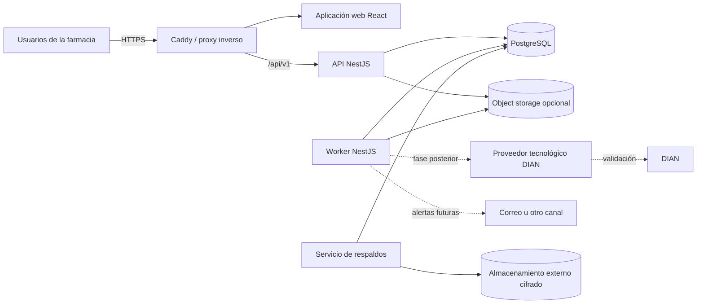
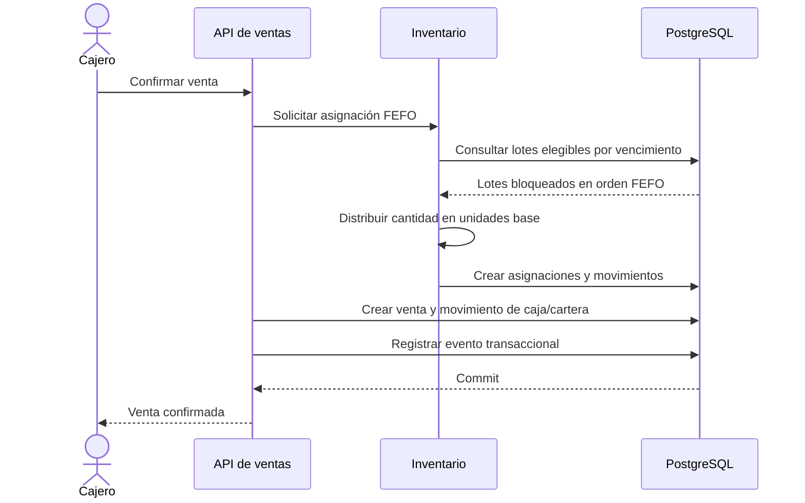

# Arquitectura de software — Sistema para farmacia

**Versión:** 0.1  
**Fecha:** 18 de septiembre de 2026  
**Documento de entrada:** `levantamiento-requerimientos-farmacia.md`  
**Estado:** propuesta técnica para validación

## 1. Resumen ejecutivo

Se propone una aplicación web cliente-servidor construida como un **monolito modular**, con una API REST, una interfaz web separada y una base de datos relacional PostgreSQL.

La solución inicial tendrá tres procesos desplegables, todos provenientes del mismo repositorio:

1. **Web:** interfaz utilizada desde el navegador.
2. **API:** autenticación, reglas de negocio y operaciones síncronas.
3. **Worker:** alertas de vencimiento, exportaciones y futuras comunicaciones con la DIAN.

La recomendación tecnológica es:

| Área | Tecnología propuesta |
|---|---|
| Lenguaje | TypeScript |
| Runtime | Node.js 24 LTS |
| Frontend | React 19.3, Vite 8.1, React Router, Material UI 9 |
| Estado remoto | TanStack Query |
| Formularios | React Hook Form y Zod |
| Backend | NestJS 11 |
| API | REST/JSON documentada con OpenAPI |
| Base de datos | PostgreSQL 18 |
| Acceso a datos | Prisma ORM 8 y SQL parametrizado para operaciones críticas |
| Procesos diferidos | Worker del mismo monolito y cola persistente en PostgreSQL |
| Proxy y HTTPS | Caddy 2 |
| Contenedores | Docker Engine y Docker Compose v2 |
| Pruebas | Vitest, Supertest, Playwright y PostgreSQL real en integración |
| Archivos futuros | Almacenamiento compatible con S3 |

No se recomienda iniciar con microservicios, Kubernetes, Redis, Kafka ni múltiples bases de datos. No existe todavía una necesidad funcional o de escala que compense su costo operativo.

## 2. Supuestos arquitectónicos

Estos supuestos no son requerimientos confirmados. Deben validarse antes de comprometer costos de infraestructura:

- La solución será utilizada por una farmacia pequeña o mediana.
- La carga será de decenas de usuarios concurrentes, no de miles.
- Se manejará una empresa y posiblemente varias sedes o bodegas.
- Los usuarios accederán mediante computadores o tabletas con navegador moderno.
- Producción tendrá conexión estable a internet.
- La operación inicial será centralizada y en línea.
- Una interrupción corta durante una ventana controlada de mantenimiento es tolerable.
- No habrá aplicación móvil nativa en el MVP.
- No se requiere funcionamiento transaccional sin conexión en el MVP.
- La facturación electrónica se integrará posteriormente mediante un proveedor tecnológico autorizado por la DIAN, salvo decisión expresa de desarrollar una integración propia.

### Supuestos que cambian sustancialmente la solución

Debe revisarse esta arquitectura si se confirma cualquiera de estas condiciones:

- La farmacia debe vender cuando no exista conexión a internet.
- Cada sede debe funcionar autónomamente y sincronizarse posteriormente.
- El producto será una plataforma SaaS para muchas farmacias independientes.
- Se esperan cientos de usuarios concurrentes o un volumen transaccional muy superior al de una farmacia convencional.
- Se exige alta disponibilidad sin ventanas de mantenimiento.

## 3. Características arquitectónicas prioritarias

### 3.1 Integridad transaccional

Una venta puede modificar inventario por lote, movimientos, caja y cartera. Estas modificaciones deben confirmarse juntas o revertirse juntas.

### 3.2 Trazabilidad

Debe conocerse qué usuario ejecutó cada operación, cuándo la realizó, qué documento la originó y qué lotes fueron afectados.

### 3.3 Consistencia de inventario

El sistema debe impedir que dos ventas concurrentes asignen la misma existencia. La selección FEFO y el descuento del inventario deben ocurrir en una transacción con bloqueo de las filas involucradas.

### 3.4 Seguridad

Los permisos deben aplicarse en el backend. Ocultar una función en la interfaz no constituye autorización.

### 3.5 Recuperación

La base de datos es un activo crítico. Deben existir respaldos externos, recuperación a un punto en el tiempo y pruebas periódicas de restauración.

### 3.6 Mantenibilidad

Los módulos deben reflejar el negocio y minimizar dependencias. La futura integración DIAN debe poder añadirse sin modificar la lógica central de ventas e inventario.

## 4. Estilo arquitectónico

### Decisión

**Monolito modular con capas internas y puertos para integraciones externas.**

NestJS permite encapsular capacidades relacionadas mediante módulos y exponer explícitamente sus dependencias, lo que encaja con los límites del dominio propuestos ([documentación oficial de módulos de NestJS](https://docs.nestjs.com/modules)).

### Razones

- Compras, ventas, lotes, inventario, caja y cartera requieren transacciones coordinadas.
- Un solo despliegue simplifica desarrollo, pruebas, soporte y recuperación.
- PostgreSQL puede cubrir la carga esperada sin particionar datos entre servicios.
- Los límites modulares permiten extraer un componente más adelante si existe evidencia real de necesidad.
- Se evita la consistencia eventual innecesaria que introducirían los microservicios.

### Consecuencias

- Los módulos compartirán una base de datos, pero no deberán acceder directamente a tablas que pertenezcan a otro módulo sin pasar por contratos internos definidos.
- La API y el worker compartirán lógica de aplicación, aunque se ejecuten como procesos separados.
- Las operaciones críticas podrán usar una misma transacción de base de datos.

## 5. Diagrama general



## 6. Organización del repositorio

Se recomienda un monorepositorio administrado con `pnpm workspaces`:

```text
farmacia/
├── apps/
│   ├── api/                 # API NestJS
│   ├── web/                 # React + Vite
│   └── worker/              # tareas programadas y cola persistente
├── packages/
│   ├── api-client/          # cliente generado desde OpenAPI
│   ├── contracts/           # tipos compartidos no ligados a persistencia
│   ├── eslint-config/
│   └── tsconfig/
├── database/
│   ├── migrations/
│   └── seeds/
├── infra/
│   ├── docker/
│   ├── compose/
│   └── scripts/
├── docs/
│   ├── adr/
│   ├── runbooks/
│   └── api/
└── tests/
    └── e2e/
```

No se recomienda añadir Turborepo inicialmente. `pnpm workspaces` cubre la necesidad actual con menor configuración.

## 7. Módulos del sistema

| Módulo | Responsabilidad | Dependencias principales |
|---|---|---|
| Identidad y acceso | Usuarios, sesiones, roles y permisos | Auditoría |
| Catálogo | Productos, categorías, presentaciones y equivalencias | Auditoría |
| Inventario | Existencias, lotes, vencimientos, FEFO y movimientos | Catálogo, sedes |
| Proveedores | Datos de proveedores | Auditoría |
| Compras | Compras, recepción, lotes y cuentas asociadas | Proveedores, catálogo, inventario, cuentas por pagar |
| Clientes | Datos de clientes | Auditoría |
| Ventas | Venta, detalle, precios, asignación de lotes y anulaciones | Clientes, catálogo, inventario, caja, cuentas por cobrar |
| Cuentas por cobrar | Obligaciones de clientes, abonos y saldos | Clientes, ventas, caja |
| Cuentas por pagar | Obligaciones con proveedores, pagos y saldos | Proveedores, compras, caja |
| Caja | Aperturas, movimientos, medios de pago y cierres | Ventas, cartera, pagos |
| Contabilidad | Plan de cuentas, impuestos parametrizados, asientos, gastos y estados financieros | Ventas, compras, inventario, caja, bancos, cartera, configuración |
| Reportes | Consultas consolidadas y exportaciones | Módulos operativos |
| Notificaciones | Alertas de vencimiento y entregas futuras | Inventario, worker |
| Auditoría | Registro de operaciones sensibles | Todos los módulos |
| Configuración | Empresa, sedes, consecutivos y parámetros | Identidad |
| Facturación electrónica | Adaptador al proveedor DIAN | Ventas, clientes, configuración, worker |

### Regla de dependencia

Los módulos se comunican mediante servicios de aplicación o eventos internos. Un controlador de ventas no debe escribir directamente en las tablas de inventario o caja.

## 8. Backend

### 8.1 Tecnología

- **Node.js 24 LTS:** versión LTS activa a la fecha del documento. Las versiones sin soporte dejan de recibir correcciones de seguridad ([ciclo oficial de Node.js](https://nodejs.org/en/about/eol)).
- **NestJS 11:** estructura modular, inyección de dependencias, validación, autorización, tareas programadas, OpenAPI y pruebas. La documentación actual recomienda usar la versión LTS activa de Node.js ([requisitos oficiales de NestJS](https://docs.nestjs.com/first-steps)).
- **TypeScript:** unifica el lenguaje de frontend y backend, permite compartir contratos y reduce errores de tipos.
- **Prisma ORM 8:** acceso tipado, migraciones y transacciones. Las consultas que requieran bloqueos explícitos o selección FEFO utilizarán SQL parametrizado dentro de la transacción.

Las versiones exactas de parche se fijarán en el archivo de dependencias y en la imagen del contenedor. Las actualizaciones de versión mayor no serán automáticas.

### 8.2 Capas internas por módulo

```text
presentation/       Controladores HTTP, DTO y serialización
application/        Casos de uso y coordinación transaccional
domain/             Entidades, reglas e invariantes de negocio
infrastructure/     PostgreSQL, archivos e integraciones externas
```

La capa de dominio no debe depender de NestJS, Prisma ni HTTP. La infraestructura implementará interfaces definidas por el módulo.

### 8.3 Convenciones

- Un caso de uso por operación relevante: `ConfirmSale`, `ReceivePurchase`, `ApplyPayment`, `AdjustInventory`.
- Validación sintáctica en el límite HTTP y validación de negocio en los casos de uso.
- Errores de dominio explícitos, convertidos a respuestas HTTP uniformes.
- Transacciones iniciadas en la capa de aplicación, no en los controladores.
- Fechas internas en UTC y presentación en la zona horaria configurada.
- Valores monetarios con `numeric`, nunca con coma flotante.
- Cantidades de inventario en unidades base enteras.
- Operaciones anuladas mediante reversión, no eliminando el historial.

## 9. Operación crítica: venta con FEFO

La confirmación de una venta deberá ejecutarse en una sola transacción:



### Reglas técnicas

1. Convertir la cantidad vendida a la unidad base del producto.
2. Seleccionar lotes con existencia disponible ordenados por fecha de vencimiento ascendente.
3. Bloquear las filas involucradas para impedir doble asignación concurrente.
4. Distribuir la cantidad entre lotes cuando el primero no sea suficiente, si esta regla es aprobada por el negocio.
5. Crear la relación entre cada línea de venta y los lotes utilizados.
6. Crear movimientos de inventario inmutables.
7. Actualizar el saldo materializado del lote.
8. Crear el movimiento de caja o la cuenta por cobrar correspondiente.
9. Confirmar todo en una sola transacción.

PostgreSQL soporta bloqueos de fila con `SELECT ... FOR UPDATE`; estos bloqueos se liberan al terminar la transacción ([documentación oficial](https://www.postgresql.org/docs/18/explicit-locking.html)).

### Invariantes

- La suma de las asignaciones por lote debe ser igual a la cantidad base de la línea vendida.
- Un saldo de lote no puede ser negativo, salvo que el cliente apruebe expresamente inventario negativo.
- Un movimiento confirmado no se edita ni se elimina; una corrección genera un movimiento inverso.
- La misma solicitud no debe confirmar dos veces una venta. Se usará una clave de idempotencia.

### Pendientes de negocio que afectan el algoritmo

- Bloqueo de lotes vencidos.
- Excepciones manuales a FEFO.
- Desempate entre lotes con la misma fecha.
- Fraccionamiento automático entre varios lotes.
- Reserva temporal de inventario durante una venta sin confirmar.

## 10. Frontend

### 10.1 Tecnología

- **React 19.3:** interfaz basada en componentes. React 19.3 es la versión publicada a la fecha de este documento ([anuncio oficial](https://react.dev/blog/2026/09/09/react-19-3)).
- **Vite 8.1:** construcción de una SPA liviana; Vite 8.1 es la versión estable anunciada en junio de 2026 ([anuncio oficial](https://vite.dev/blog/announcing-vite8-1)).
- **Material UI 9:** componentes accesibles y adecuados para aplicaciones administrativas. Se usará el paquete comunitario; cualquier componente comercial requerirá aprobación de licencia.
- **React Router:** rutas y layouts protegidos.
- **TanStack Query:** estado remoto, caché de consultas y revalidación.
- **React Hook Form y Zod:** formularios y validaciones de experiencia de usuario.

No se requiere renderizado del lado del servidor porque es una aplicación operativa privada, no un sitio que dependa de posicionamiento en buscadores.

### 10.2 Áreas de navegación

- Inicio y alertas.
- Productos y categorías.
- Inventario, lotes y movimientos.
- Compras y proveedores.
- Ventas y clientes.
- Cuentas por cobrar.
- Cuentas por pagar.
- Caja.
- Reportes.
- Usuarios y permisos.
- Configuración.

### 10.3 Estado y permisos

- TanStack Query administrará datos provenientes de la API.
- El estado local se limitará a formularios, filtros y preferencias visuales.
- No se duplicarán entidades del servidor en un almacén global innecesario.
- El frontend ocultará o deshabilitará acciones según permisos para mejorar la experiencia.
- El backend volverá a validar todos los permisos.

### 10.4 Operación sin conexión

La interfaz podrá ser instalable como PWA y almacenar recursos estáticos, pero **no confirmará ventas sin conexión** en la primera versión. Una estrategia offline real requiere resolución de conflictos, numeración, sincronización de inventario y manejo de caja local; debe tratarse como una decisión arquitectónica independiente.

## 11. API

### 11.1 Estilo

- REST sobre HTTPS.
- JSON para solicitudes y respuestas.
- Prefijo `/api/v1`.
- Especificación OpenAPI generada desde el backend.
- Cliente TypeScript generado para el frontend.

### 11.2 Recursos principales

```text
/auth
/users
/roles
/permissions
/categories
/products
/product-presentations
/locations
/lots
/inventory-balances
/inventory-movements
/suppliers
/purchases
/customers
/sales
/receivables
/payables
/cash-sessions
/cash-movements
/bank-accounts
/accounts
/journal-entries
/expenses
/tax-rules
/reports
/alerts
/settings
/audit-events
/electronic-documents      # fase DIAN
```

### 11.3 Operaciones de negocio

Las transiciones importantes se representarán como comandos, no como actualizaciones genéricas:

```text
POST /api/v1/purchases/{id}/receive
POST /api/v1/purchases/{id}/cancel
POST /api/v1/sales/{id}/confirm
POST /api/v1/sales/{id}/cancel
POST /api/v1/receivables/{id}/payments
POST /api/v1/payables/{id}/payments
POST /api/v1/cash-sessions/{id}/close
POST /api/v1/inventory-adjustments
POST /api/v1/accounts/import
POST /api/v1/journal-entries/{id}/reverse
POST /api/v1/expenses/{id}/pay
```

Los nombres y estados definitivos dependen de la validación del flujo de negocio.

### 11.4 Contratos transversales

- Paginación por cursor o por página para listados administrativos.
- Filtros explícitos por fechas, estados, productos, lotes y sedes.
- Formato uniforme de errores con código, mensaje, detalles y `correlationId`.
- Encabezado `Idempotency-Key` para confirmaciones, pagos e integraciones externas.
- Límites de tamaño de solicitud.
- Versionado sólo cuando exista un cambio incompatible.

No se propone GraphQL porque las operaciones son transaccionales y los recursos REST son suficientes para el alcance actual.

## 12. Base de datos

### 12.1 Selección

Se recomienda **PostgreSQL 18** por las siguientes razones:

- Transacciones ACID.
- Restricciones e integridad referencial.
- Bloqueos de fila necesarios para inventario concurrente.
- Tipos numéricos exactos para valores monetarios.
- Buen soporte para índices, reportes y consultas relacionales.
- Recuperación a un punto en el tiempo mediante WAL.

PostgreSQL 18 es la versión estable vigente a la fecha del documento ([información oficial de versiones](https://www.postgresql.org/about/press/faq/)).

### 12.2 Grupos de entidades

#### Identidad

- `users`
- `roles`
- `permissions`
- `user_roles`
- `role_permissions`
- `sessions`

#### Catálogo

- `categories`
- `products`
- `product_presentations`
- `price_lists` y `product_prices`, únicamente si el negocio confirma listas de precios

#### Inventario

- `locations`
- `inventory_lots`
- `inventory_balances`
- `inventory_movements`
- `inventory_adjustments`
- `stock_transfers`, si se confirman varias ubicaciones

#### Compras

- `suppliers`
- `purchases`
- `purchase_lines`
- `purchase_receipts`
- `purchase_receipt_lines`

#### Ventas

- `customers`
- `sales`
- `sale_lines`
- `sale_lot_allocations`
- `sale_payments`

#### Finanzas operativas

- `receivables`
- `receivable_payments`
- `payables`
- `payable_payments`
- `cash_registers`
- `cash_sessions`
- `cash_movements`

#### Contabilidad

- `chart_of_accounts` y `accounting_periods`
- `journal_entries` y `journal_entry_lines`
- `bank_accounts` y `bank_movements`
- `expenses` y `expense_categories`
- `tax_rules`, `product_tax_profiles` y configuraciones tributarias de terceros, con vigencia

Las cuentas, reglas tributarias y perfiles de producto son configurables. Los valores comerciales y contables confirmados conservarán los importes aplicados (base, impuesto, total y costo), de modo que un cambio posterior de configuración no reescriba el historial.

El motor contable debe resolver propósitos estables (`CASH`, `BANK`, `CUSTOMERS`, `SUPPLIERS`, `INVENTORY`, `SALES_TAXED`, `SALES_EXCLUDED`, `COST_OF_SALES`, `VAT_OUTPUT`, `VAT_INPUT`, `VAT_INPUT_COMMON`, `SIMPLE_TAX_ADVANCE`, `SALES_RETURNS` y `SALES_DISCOUNTS`) contra cuentas reales configuradas para la empresa. Los casos de uso no deben depender de códigos contables fijos.

#### Plataforma

- `audit_events`
- `outbox_events`
- `background_jobs`
- `idempotency_keys`
- `settings`
- `electronic_documents`, en la fase DIAN

Estos nombres son conceptuales. El diseño físico detallado debe validarse antes de generar migraciones.

### 12.3 Representación de presentaciones

Cada producto tendrá una unidad base discreta. Por ejemplo:

```text
Unidad = 1 unidad base
Blíster = 10 unidades base
Caja = 10 blísteres = 100 unidades base
```

La compra o venta conservará:

- Presentación utilizada.
- Cantidad en la presentación.
- Factor aplicado en ese momento.
- Cantidad resultante en unidades base.

Conservar el factor histórico evita que una modificación posterior en la presentación altere documentos ya confirmados.

### 12.4 Movimientos y saldos

`inventory_movements` será el libro inmutable de inventario. `inventory_balances` e `inventory_lots.current_quantity` serán saldos materializados para consultar rápidamente.

Cada transacción comprobará que:

```text
saldo anterior + suma de movimientos = saldo nuevo
```

Se añadirá una tarea de conciliación que detecte diferencias entre el libro y los saldos materializados.

### 12.5 Índices iniciales

- Producto por código interno y código de barras.
- Lote por producto, ubicación, vencimiento y saldo disponible.
- Movimientos por producto, lote, ubicación y fecha.
- Ventas y compras por fecha, estado y tercero.
- Cuentas por cobrar/pagar por tercero, estado y vencimiento.
- Auditoría por usuario, entidad y fecha.

Los índices definitivos se validarán con consultas reales y `EXPLAIN ANALYZE`; no se crearán índices indiscriminadamente.

## 13. Autenticación y autorización

### Decisión inicial

Autenticación local mediante usuario o correo y contraseña. Se usarán sesiones opacas almacenadas en PostgreSQL, entregadas en una cookie con:

- `HttpOnly`.
- `Secure`.
- `SameSite=Lax` o más restrictivo según el flujo.
- Expiración absoluta e inactividad máxima.

### Razones para sesiones en lugar de JWT persistentes

- El frontend y la API se servirán bajo el mismo dominio.
- Se necesita revocar acceso inmediatamente al desactivar un usuario.
- No existe inicialmente un ecosistema de servicios distribuidos.
- Se evita almacenar tokens de larga duración en el navegador.

### Controles

- Contraseñas almacenadas con Argon2id.
- Protección contra intentos repetidos y enumeración de usuarios.
- Rotación de sesión al autenticar y al cambiar privilegios.
- Protección CSRF para operaciones mutables.
- Permisos verificados en cada caso de uso.
- Registro de inicio de sesión, cierre, fallos y cambios de permisos.
- Recuperación de contraseña mediante token de un solo uso y corta duración, cuando se configure correo.
- MFA recomendado para administradores, sujeto a validación.

## 14. Procesamiento asíncrono

El worker ejecutará:

- Evaluación programada de lotes próximos a vencer.
- Entrega de notificaciones cuando exista un canal configurado.
- Generación de exportaciones pesadas.
- Conciliaciones de inventario.
- Reintentos de integraciones externas.
- Procesamiento DIAN en la fase futura.

Los trabajos se guardarán en PostgreSQL con estados, fecha de próximo intento, cantidad de intentos y último error. Varios workers podrán reclamar trabajos mediante bloqueos de fila.

No se añade Redis inicialmente. Si el volumen de trabajos demuestra que PostgreSQL es insuficiente, podrá incorporarse una cola especializada sin cambiar los casos de uso del dominio.

## 15. Facturación electrónica DIAN

### Decisión recomendada

Integrar un **proveedor tecnológico autorizado** mediante un adaptador, en lugar de implementar inicialmente todo el protocolo fiscal de forma directa.

La DIAN permite operar con software gratuito, desarrollo propio o proveedor tecnológico, y exige pruebas de habilitación para software propio o de proveedor ([requerimientos oficiales](https://micrositios.dian.gov.co/sistema-de-facturacion-electronica/requerimientos-para-ser-facturador-electronico/)). Además, publica el catálogo de proveedores autorizados ([catálogo DIAN](https://micrositios.dian.gov.co/sistema-de-facturacion-electronica/proveedores-tecnologicos/)).

### Puerto interno

```text
ElectronicInvoicingProvider
├── submitInvoice()
├── getDocumentStatus()
├── submitCreditNote()
├── submitDebitNote()
└── downloadArtifacts()
```

Cada proveedor implementará este contrato sin contaminar el módulo de ventas.

### Flujo futuro

1. La venta confirmada crea un evento en `outbox_events` dentro de la misma transacción.
2. El worker crea el documento fiscal y lo envía al proveedor.
3. Se registra el identificador externo y el estado.
4. Fallos transitorios generan reintentos con espera creciente.
5. Un rechazo funcional se muestra para corrección y no se reintenta indefinidamente.
6. Se conservan solicitud, respuesta, XML, representación gráfica y trazabilidad requerida.

La documentación técnica de la DIAN cambia por versiones; la integración debe apoyarse en el anexo vigente al momento de implementarla ([documentación técnica DIAN](https://micrositios.dian.gov.co/sistema-de-facturacion-electronica/documentacion-tecnica/)).

## 16. Archivos

En el MVP no se confirma almacenamiento significativo de archivos.

Cuando se incorporen facturas, soportes o imágenes:

- Guardar binarios en almacenamiento compatible con S3.
- Guardar en PostgreSQL sólo metadatos, propietario, hash, tipo y clave del objeto.
- Validar MIME, extensión y tamaño.
- Utilizar nombres internos no predecibles.
- Acceder mediante URLs temporales o a través de autorización del backend.
- Activar cifrado, versionado y política de retención.
- Incluir los metadatos y objetos en el plan de recuperación.

No se almacenarán archivos binarios grandes dentro de PostgreSQL.

## 17. Infraestructura

### 17.1 Topología recomendada de producción

#### Opción preferida

- Un servidor Linux LTS para Caddy, web, API y worker mediante Docker Compose.
- PostgreSQL administrado en red privada.
- Almacenamiento de objetos administrado cuando sea necesario.
- Servicio externo de respaldos o almacenamiento en una cuenta/proveedor separado.
- DNS y certificados TLS automáticos.

#### Opción de presupuesto mínimo

- Un solo servidor Linux LTS con todos los contenedores, incluido PostgreSQL.
- Volumen persistente exclusivo para la base de datos.
- Respaldos cifrados enviados fuera del servidor.

La segunda opción reduce costos, pero aumenta el tiempo de recuperación y concentra el riesgo en un único equipo.

### 17.2 Tamaño inicial de referencia

Hasta disponer de mediciones reales:

- Aplicación: 2–4 vCPU y 4–8 GB de RAM.
- Base de datos administrada: instancia pequeña con almacenamiento SSD, respaldos y capacidad de crecimiento.
- Disco de aplicación con alertas al 70 % y 85 % de utilización.

Esto es un punto de partida, no un dimensionamiento contractual.

### 17.3 Red

- Sólo Caddy expone puertos 80 y 443.
- API, worker y PostgreSQL permanecen en red privada.
- PostgreSQL no se publica en internet.
- Acceso administrativo mediante canal seguro y cuentas individuales.
- HTTPS obligatorio.
- Cabeceras de seguridad configuradas en el proxy y la API.

Docker documenta Compose como una opción válida para desplegar aplicaciones en un único servidor y recomienda configuración específica de producción, políticas de reinicio y ausencia de montajes del código fuente ([guía oficial](https://docs.docker.com/compose/how-tos/production/)).

## 18. Ambientes

| Ambiente | Propósito | Datos |
|---|---|---|
| Desarrollo | Trabajo local y pruebas rápidas | Sintéticos |
| CI | Pruebas automatizadas efímeras | Sintéticos |
| Staging | Validación integrada y aceptación | Anonimizados o sintéticos |
| Producción | Operación real | Reales |

Cada ambiente tendrá:

- Base de datos independiente.
- Secretos independientes.
- Dominio o subdominio independiente.
- Integraciones externas separadas.
- Claves y credenciales sin reutilización.

No se copiarán datos personales de producción a desarrollo.

## 19. Integración y despliegue continuo

### 19.1 Pipeline de integración

Cada cambio deberá ejecutar:

1. Instalación reproducible desde el lockfile.
2. Formato, lint y comprobación de tipos.
3. Pruebas unitarias.
4. Pruebas de integración contra PostgreSQL real.
5. Construcción del frontend, API y worker.
6. Pruebas end-to-end de flujos críticos.
7. Análisis de dependencias y vulnerabilidades.
8. Construcción de imágenes inmutables etiquetadas con el commit.

### 19.2 Despliegue a staging

1. Obtener imágenes ya construidas por CI.
2. Aplicar migraciones pendientes.
3. Iniciar contenedores.
4. Esperar verificaciones de salud.
5. Ejecutar pruebas de humo.

### 19.3 Despliegue a producción

1. Requiere aprobación manual.
2. Verificar respaldo reciente y estado del sistema.
3. Aplicar migraciones compatibles con la versión anterior.
4. Actualizar API, worker y web.
5. Validar salud técnica y una operación funcional de lectura.
6. Vigilar errores y latencia durante el periodo de observación.

### 19.4 Migraciones

- Las migraciones se guardan en control de versiones.
- Producción nunca usa sincronización automática destructiva del esquema.
- Cambios riesgosos siguen el patrón expandir/contraer.
- Eliminaciones de columnas ocurren en un despliegue posterior al que dejó de utilizarlas.
- Las migraciones se prueban sobre una copia representativa antes de producción.

Prisma documenta migraciones transaccionales en PostgreSQL y el patrón expandir/contraer para cambios compatibles ([documentación oficial](https://www.prisma.io/docs/guides/database/data-migration)).

### 19.5 Rollback

- Mantener disponibles las últimas imágenes estables.
- Revertir el tráfico a la versión anterior cuando el esquema siga siendo compatible.
- No intentar revertir automáticamente migraciones destructivas.
- Restaurar la base de datos sólo ante corrupción o pérdida, siguiendo un procedimiento aprobado.
- Documentar cada incidente y su recuperación.

## 20. Backups y recuperación

### Objetivos propuestos para validación

- **RPO:** máximo 15 minutos de pérdida de datos.
- **RTO:** máximo 4 horas para restaurar la operación.

### Estrategia preferida

- Recuperación a un punto en el tiempo mediante archivado WAL del PostgreSQL administrado.
- Retención mínima de PITR: 14 días.
- Respaldo lógico diario cifrado y almacenado fuera del proveedor principal.
- Retención de respaldos diarios: 30 días.
- Retención mensual: 12 meses, sujeta a política legal y de costos.
- Versionado de los objetos almacenados.
- Prueba automatizada de integridad después de cada respaldo lógico.
- Restauración completa de prueba al menos una vez al mes.
- Simulacro de recuperación documentado al menos dos veces al año.

PostgreSQL contempla respaldos lógicos, respaldos físicos y archivado continuo con recuperación a un punto en el tiempo ([documentación oficial de PostgreSQL 18](https://www.postgresql.org/docs/18/backup.html)).

Los respaldos deben incluir:

- Base de datos.
- Archivos almacenados.
- Configuración necesaria para reconstruir el servicio.
- Versiones de las imágenes desplegadas.
- Manual de restauración.

Un respaldo no se considerará confiable hasta haber sido restaurado y validado.

## 21. Observabilidad

### Logs

- Logs JSON estructurados mediante Pino.
- `correlationId` por solicitud.
- Identificación de ambiente, servicio y versión.
- Sin contraseñas, cookies, tokens ni información sensible innecesaria.
- Retención y rotación definidas.

### Salud

- `/health/live`: el proceso está activo.
- `/health/ready`: puede atender tráfico y acceder a dependencias críticas.
- Estado separado del worker y trabajos pendientes.

### Métricas mínimas

- Disponibilidad y latencia HTTP.
- Tasa de errores por endpoint.
- Uso de CPU, memoria y disco.
- Conexiones y latencia de PostgreSQL.
- Tamaño de la cola y antigüedad del trabajo más viejo.
- Fallos de jobs e integraciones.
- Fecha y resultado del último respaldo.
- Diferencias detectadas en conciliación de inventario.

### Alertas

- Servicio no disponible.
- Errores HTTP elevados.
- Base de datos sin conexión.
- Disco próximo a agotarse.
- Respaldo fallido o atrasado.
- Cola detenida.
- Integración DIAN fallando repetidamente.

No se requiere inicialmente una plataforma compleja de trazas distribuidas porque no hay microservicios.

## 22. Seguridad

### Aplicación

- Autorización obligatoria en backend.
- Validación de todas las entradas.
- Consultas parametrizadas.
- Protección CSRF, XSS y clickjacking.
- Límite de intentos en autenticación y endpoints sensibles.
- Cookies seguras y expiración de sesiones.
- Principio de mínimo privilegio.
- Auditoría de acciones críticas.

### Infraestructura

- TLS en tránsito.
- Cifrado en reposo para base de datos, volúmenes y respaldos.
- Contenedores ejecutados como usuario no privilegiado.
- Imágenes mínimas y actualizadas.
- Secretos fuera del repositorio y de las imágenes.
- PostgreSQL accesible sólo desde la red privada.
- Cuentas administrativas individuales.
- Parches mensuales y atención prioritaria a vulnerabilidades críticas.

### Datos

- Separar permisos para consultar costos, utilidades y datos personales.
- Enmascarar información sensible en logs.
- Definir retención y eliminación según obligaciones aplicables.
- No reutilizar datos reales en pruebas.

Antes de producción se recomienda una revisión específica de seguridad y protección de datos.

## 23. Estrategia de pruebas

### Unitarias

- Equivalencias entre unidad, blíster y caja.
- Selección FEFO.
- Distribución entre lotes.
- Cálculo de saldos de cartera.
- Transiciones de estados.
- Permisos.

### Integración

- Transacciones reales en PostgreSQL.
- Bloqueos y ventas concurrentes sobre el mismo lote.
- Rollback completo ante un fallo intermedio.
- Restricciones e índices.
- Procesamiento idempotente de trabajos.

### End-to-end

- Inicio de sesión.
- Recepción de compra con lotes.
- Venta que aplique FEFO.
- Venta que consuma varios lotes, si se confirma la regla.
- Recaudo y movimiento de caja.
- Cierre de caja.
- Bloqueo por falta de permiso.
- Generación de reportes principales.

### Recuperación

- Restauración de base de datos.
- Restauración de archivos.
- Verificación de consistencia posterior.

## 24. Escalabilidad

### Capacidad inicial

Una instancia de API, una de worker y PostgreSQL cubren el escenario supuesto.

### Evolución basada en evidencia

1. Optimizar consultas e índices.
2. Aumentar recursos verticalmente.
3. Añadir una segunda instancia de API detrás del proxy.
4. Separar workers por tipo de trabajo.
5. Añadir réplica de lectura sólo si los reportes afectan la operación.
6. Incorporar una cola externa si la cola PostgreSQL se vuelve un cuello de botella.
7. Extraer un servicio únicamente cuando tenga escala, disponibilidad o ciclo de cambios claramente independiente.

No se añadirá caché distribuida antes de medir una necesidad concreta. Los saldos de inventario y cartera deben obtenerse de una fuente consistente.

## 25. Riesgos técnicos

| Riesgo | Nivel | Impacto | Mitigación |
|---|---|---|---|
| Reglas incompletas de caja, crédito y anulaciones | Alto | Rediseño de flujos y datos | Cerrar decisiones antes de implementar esos módulos |
| Ventas concurrentes sobre el mismo lote | Alto | Inventario negativo o duplicado | Transacciones, bloqueos de fila y pruebas de concurrencia |
| Respaldo no restaurable | Alto | Pérdida de operación | PITR, copias externas y simulacros de restauración |
| Necesidad de operar sin internet descubierta tarde | Alto | Cambio arquitectónico significativo | Confirmar conectividad y contingencia antes del desarrollo |
| Cambios regulatorios DIAN | Alto | Rechazo de documentos | Adaptador aislado, proveedor autorizado y versionado de contratos |
| Permisos insuficientemente definidos | Medio | Exposición o acciones no autorizadas | Matriz de permisos y pruebas por rol |
| Equivalencias configuradas incorrectamente | Alto | Diferencias de inventario | Validaciones, vigencia histórica y auditoría |
| Reportes pesados sobre la base operativa | Medio | Lentitud en ventas | Límites, índices, exportaciones asíncronas y réplica futura si se justifica |
| Dependencia de un proveedor de infraestructura | Medio | Dificultad de migración | Contenedores, PostgreSQL estándar y respaldos portables |
| Archivos o logs con datos sensibles | Medio | Incidente de privacidad | Clasificación, acceso restringido, cifrado y sanitización |

## 26. Decisiones arquitectónicas

### ADR-001 — Monolito modular

**Decisión:** implementar una sola aplicación de negocio dividida en módulos.  
**Alternativas:** microservicios o aplicación monolítica sin límites.  
**Razón:** facilita transacciones, reduce costos operativos y conserva límites mantenibles.  
**Consecuencia:** los módulos requieren disciplina para no acoplarse mediante acceso directo a sus tablas.

### ADR-002 — PostgreSQL como única base transaccional

**Decisión:** utilizar PostgreSQL 18.  
**Alternativas:** MongoDB, varias bases por módulo o una combinación SQL/NoSQL.  
**Razón:** el dominio es relacional y exige integridad, transacciones y bloqueos.  
**Consecuencia:** reportes y colas iniciales también usarán PostgreSQL.

### ADR-003 — SPA React separada de la API

**Decisión:** React con Vite y API REST.  
**Alternativas:** renderizado completo en servidor o aplicación de escritorio.  
**Razón:** la interfaz es privada, interactiva y puede evolucionar independientemente del backend.  
**Consecuencia:** se debe mantener un contrato OpenAPI y controlar compatibilidad.

### ADR-004 — Sesiones opacas en cookies

**Decisión:** sesiones persistidas y revocables.  
**Alternativas:** JWT de larga duración en el navegador.  
**Razón:** despliegue bajo un mismo dominio y necesidad de revocación inmediata.  
**Consecuencia:** la base de datos participa en la validación de sesión; puede añadirse caché sólo si las métricas lo requieren.

### ADR-005 — Cola persistente en PostgreSQL

**Decisión:** jobs y outbox en la base existente.  
**Alternativas:** Redis/BullMQ, RabbitMQ o servicios cloud de mensajería.  
**Razón:** volumen inicial bajo y necesidad de reducir componentes.  
**Consecuencia:** debe vigilarse la limpieza, indexación y latencia de la cola.

### ADR-006 — Proveedor tecnológico para DIAN

**Decisión:** diseñar un adaptador para un proveedor autorizado.  
**Alternativas:** integración propia directa con DIAN.  
**Razón:** reduce el alcance regulatorio y operativo inicial.  
**Consecuencia:** existe costo y dependencia externa; el contrato interno permitirá cambiar de proveedor.

### ADR-007 — Docker Compose en servidor único

**Decisión:** usar contenedores en un servidor para la capa de aplicación.  
**Alternativas:** Kubernetes, plataforma serverless o instalación manual.  
**Razón:** operación sencilla y suficiente para la escala esperada.  
**Consecuencia:** la alta disponibilidad será limitada hasta incorporar redundancia.

## 27. Fases técnicas recomendadas

### Fase 0 — Cierre de decisiones

- Sedes, bodegas y cajas.
- Conectividad y contingencia.
- Volumen esperado.
- Matriz de roles y permisos.
- Estados de compras, ventas y caja.
- Reglas definitivas de FEFO y vencidos.
- Objetivos RPO/RTO.

### Fase 1 — Fundamentos

- Repositorio y pipeline.
- Ambientes.
- Autenticación y autorización.
- Auditoría.
- Catálogo, presentaciones, ubicaciones, lotes e inventario.
- Pruebas de concurrencia y FEFO.

### Fase 2 — Operación comercial

- Proveedores y compras.
- Clientes y ventas.
- Caja.
- Movimientos y alertas.

### Fase 3 — Finanzas operativas, contabilidad y reportes

- Cuentas por cobrar.
- Cuentas por pagar.
- Tesorería bancaria y gastos por causación.
- Plan de cuentas, motor de asientos y estados financieros.
- Reportes y exportaciones.
- Conciliaciones.

### Fase 4 — Puesta en producción

- Endurecimiento de seguridad.
- Carga o migración inicial.
- Pruebas de recuperación.
- Capacitación.
- Monitoreo y soporte.

### Fase 5 — Facturación electrónica

- Selección del proveedor.
- Datos tributarios.
- Habilitación y pruebas.
- Adaptador y worker.
- Documentos, estados y contingencias.

## 28. Decisiones pendientes antes de construir

1. ¿Se manejará una o varias sedes, bodegas y cajas?
2. ¿Debe operar el punto de venta cuando no haya internet?
3. ¿Cuál es el número esperado de usuarios concurrentes y ventas por día?
4. ¿El producto será exclusivo para una farmacia o se proyecta como SaaS?
5. ¿Cuáles son los estados y reglas de confirmación/anulación de compras y ventas?
6. ¿Se bloquean productos vencidos y se permite omitir FEFO?
7. ¿Qué lectores, impresoras y cajones de dinero deben integrarse?
8. ¿Qué disponibilidad, RPO y RTO puede costear y necesita el negocio?
9. ¿Qué archivos deben conservarse y por cuánto tiempo?
10. ¿Qué proveedor tecnológico DIAN se utilizará?
11. ¿Cuáles son las responsabilidades tributarias, tarifas, retenciones y cuentas contables aprobadas para la farmacia y sus terceros?
12. ¿Cuál es la experiencia tecnológica del equipo que desarrollará y operará el sistema?

## 29. Resultado de la propuesta

La arquitectura seleccionada cubre el alcance actual con una plataforma sencilla de operar, mantiene consistencia fuerte en inventario y permite incorporar facturación electrónica sin introducir microservicios desde el inicio. Los principales puntos que deben cerrarse antes de implementar son la operación sin conexión, la cantidad de sedes, las reglas definitivas de FEFO/caja y los objetivos de recuperación.
